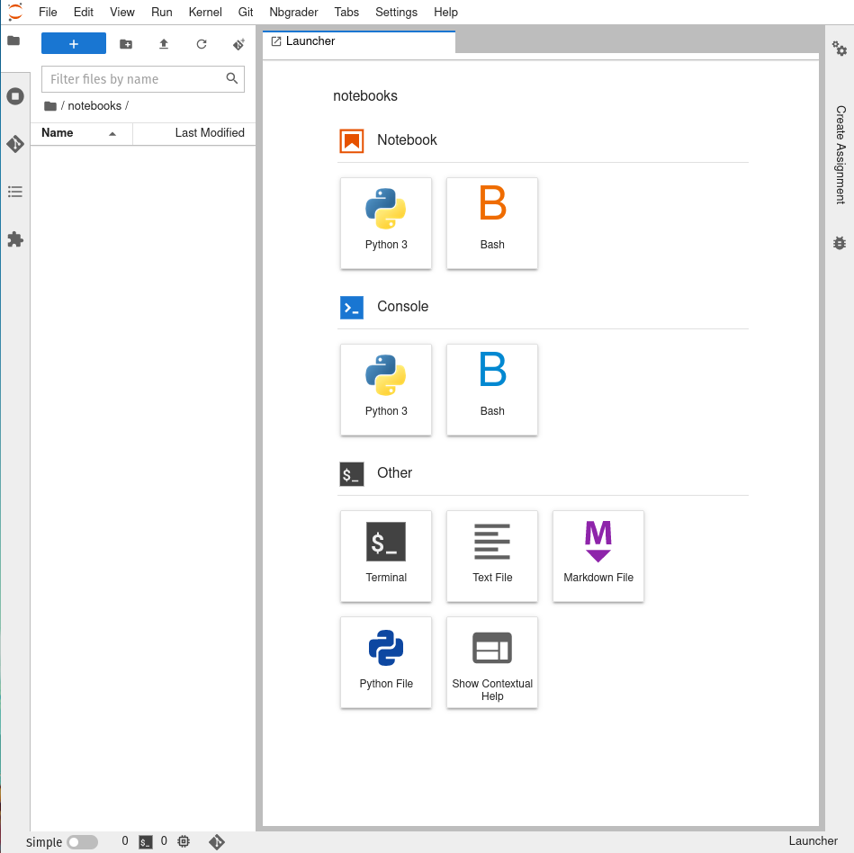
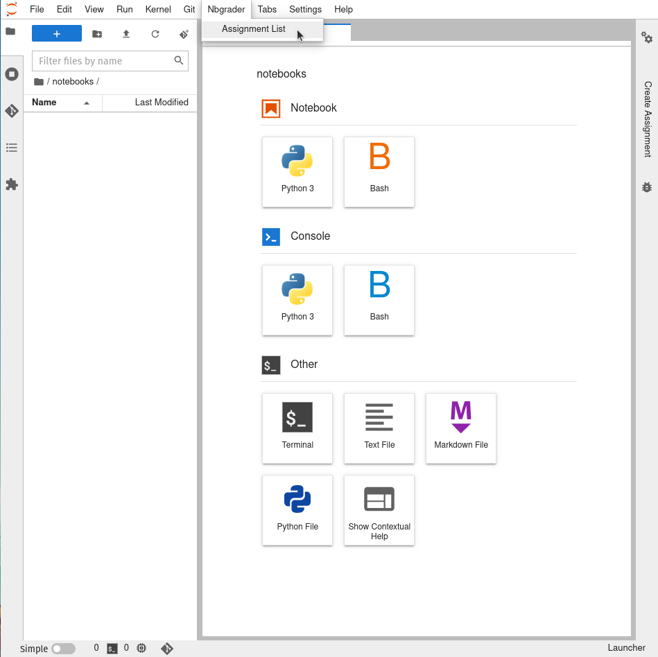
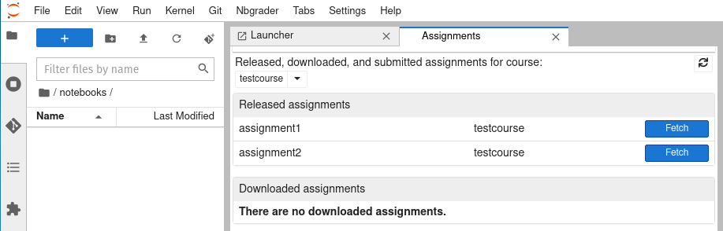
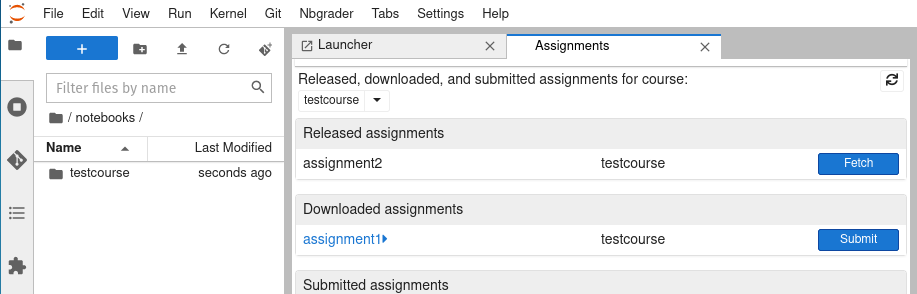
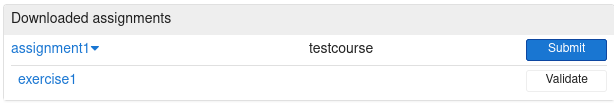
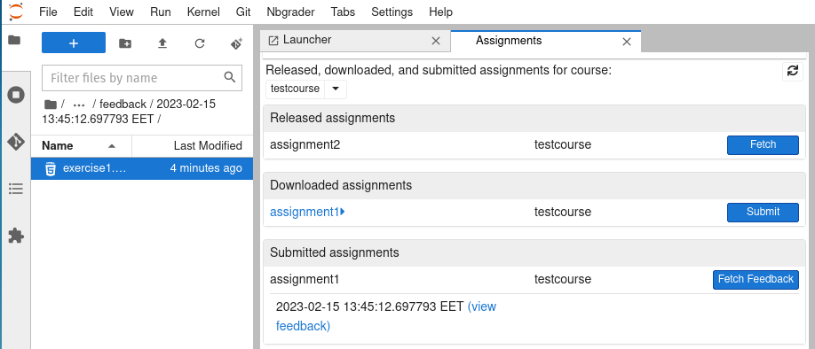

Doing Assignments in JupyterLab
===============================

.. note::

    This is a tutorial for courses that distribute and collect
    their assignments on `JupyterHub <https://jupyter.cs.aalto.fi>`__.
    Feel free to use JupyterHub for your other courses as well, but
    note that you won't be able to collect and submit your
    assignments this way.

Go to https://jupyter.cs.aalto.fi and sign in with your account to access JupyterHub.
You can find more general information about it in :doc:`../jupyterhub`.
Select your course and start a session. Your will see that you are under the ``notebooks/`` folder,
which is your home directory. Make sure you put everything important here, files saved
elsewhere will get deleted when your session ends.

|

You can see currently available assignments by going to "Nbgrader->Assignment List"
in the menu bar.

|

If no assignments are visible, make sure the right course is selected
in the drop down menu. It might also be possible that your instructor has
not released any assignments yet.

Click in the "Fetch" button to download the assignment into ``notebooks/<course-name>/``.

|

You can also click on the assignment name under "Downloaded assignments" to list
and quickly open the associated notebooks.

|

Follow the instructions in the notebook, and don't forget to save your work!
Once you are done, you can go back to the Assignment List and press the "Submit" button.
You can submit an assignment multiple times, but your instructor will probably use
only your latest submission.

At this point, you can delete the assignment files from your ``notebooks/`` directory if you'd like,
but it is often a good idea to keep a copy of your work somewhere.

Some courses might also give you feedback on your assignment here.
If you press the "Fetch Feedback" button before your instructor releases feedback,
nothing will happen. Pressing the button when feedback is available will download
it into ``notebooks/<course-name>/feedback/<submission>/``. You can also
click on "view feedback" to open this folder immediately.

|

Each notebook in the assignment will have a corresponding feedback file,
where you can see how your responses were graded along with comments left by the grader.

Tips and Good to Knows
----------------------
* Don't forget to submit your assignment. Without you submitting it, your instructor
  will not have any access to your work.

* **Don't duplicate cells**. Copy and pasting cells might lead to your work being ignored.
  It is safe to copy-paste the contents of the cell, but the cell itself should be added
  anew (using the plus button on the toolbar or 'b').

* Validate is nothing special, it is basically equivalent to restarting the kernel
  and running all cells.

* **Google Colab warning**: In the past, users have reported issues with using Google Colab
  for their assignments. **Uploading your assignment notebooks to Colab might create problems.**
  While it was working the last time we checked (Feb 2023), Colab can overwrite the metadata of
  your notebook and break nbgrader functionality. If you want to use Colab safely, you should
  copy-paste your code back to the notebook in JupyterHub instead of uploading the Colab-edited
  notebook.
