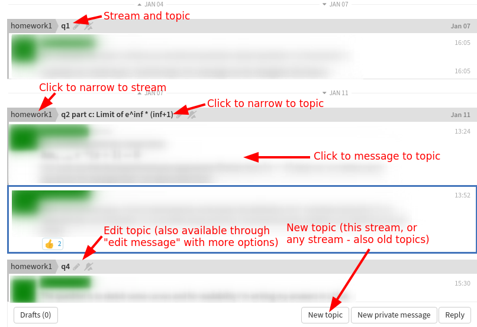
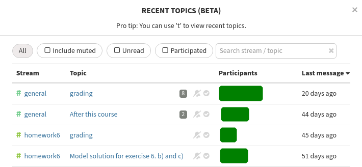

Zulip
=====

.. seealso::

   Instructors, see the relocated instructor page at
   :doc:`zulip/instructors`.

.. admonition:: Aalto Scicomp Zulip - researcher and staff discussion

   If you are a researcher looking for the ASC chat for help and
   support, see :ref:`the chat help section <chat>` or log in directly at
   https://scicomp.zulip.cs.aalto.fi .

Zulip is a open-source chat platform, which CS hosts at Aalto.
It is used as a chat platform for some courses, and allows better
student and chat privacy.

The primary distinguishing feature of Zulip is **topics**, which
allows one to make order out of a huge number of messages.  By using
topics, you can narrow to a certain thread of conversation while not
losing sight of the overall flow of messages.

.. toctree::
   :hidden:

   zulip/instructors

Basics
------

Streams and Topics
^^^^^^^^^^^^^^^^^^

In Zulip, discussions are orginized in **streams**, which are further
divided into **topics**.

Views
^^^^^

.. sidebar:: Main views

   .. figure:: zulip/img/zulip-sidebar.png
      :align: center

      Sidebar of Zulip, with highlights of the ways to follow
      conversations.  See text for explanations.

The left **sidebar** let's you narrow down messages that are displayed,
you can select:

* **All messages**, to see everything that is being posted
  efficiently.

* **Recent topics**, to see which topics have new information.

* **Different streams and topics**, to narrow down to a specific
  stream or topic.

**Recent topics** is good to manage a flood of information (see what's
new, click on relevant stuff, ignore all the rest). **All messages** is
better when you are caught up and want to make sure you don't miss
anything. Viewing **single topics and streams** is good for catching up on
something you don't remember.

Of course, everyone has their own ways and workflows so you should
experiment what works best and which views are useful for you.

Message Pane
^^^^^^^^^^^^
In the middle of your screen, you have the **Message Pane**, where the messages
are shown.

   **Message Pane**. This is the basic view of messages.  You can click
   on various places to narrow your view to one conversation or reply.

Selecting visible topics
^^^^^^^^^^^^^^^^^^^^^^^^

Not all streams are visible in the sidebar by default.

Click the gear icon above the channel list in order to see all available streams
and select which ones you want to participate in. It is good to occasionally look at
this menu in case new streams are added.

   Recent topics, another view of recent activity that shows activity
   per-topic.

Hints on using Zulip efficiently
--------------------------------

How to ask a question
^^^^^^^^^^^^^^^^^^^^^

Seems obvious, doesn't it?  You can get the best and fastest answers
by helping to keep things organized.  These recommendations are mainly
for Q&A-forum type chats.

- First, search history to see if it has already been asked.

  - If so, click on the topic name.  You will narrow your view to see
    that entire conversation.

- If your question isn't answered yet, but is a follow up to an
  existing topic, click on a message in that topic.  Then, when you
  ask, it will go to that same topic as a follow-up, and anyone else
  can narrow to see the whole history.

  .. figure:: zulip/img/zulip-reply.png
     :width: 300px
     :align: right

     Replying to an existing topic.

  - Unlike other chats, your message will *not* get lost, and people
    will both see that it is new *and* can see the history of that
    thread.

  - Your course can say what the threshold for "new topic" is.  Maybe
    they would have one topic per question pre-created or something
    clever like that.

- If you don't find anything relevant to follow up on, make a new topic.

  .. figure:: zulip/img/zulip-new.png
     :width: 300px
     :align: right

     Making a new topic.

  - Select the stream you want to post to (whatever fits best).

  - Click "New topic".

  - Enter the topic name down below: a few words, like an email
    subject.  For example, ``week 1 question 3``, ``integrals of
    complex functions``, ``exam preparation``.

  - Enter your message and send.

Others (or you...) can split or join topics if they want by going to
"edit message", so there is no risk of doing something wrong.  Don't
worry, just ask!

By being organized, you can get both the benefits of quick chat with
the organization of not missing anything.

Other hints
^^^^^^^^^^^

- You can format your messages using `Zulip markdown
  <https://zulip.com/help/format-your-message-using-markdown>`__.

- Are you annoyed by having to enter a topic every time you send a
  message?  Remember, when replying you don't need to.  But otherwise,
  it's a trade-off: keep it organized or be less searchable.  Most of
  users are clear that keeping organized is worth the searchability.
  But don't worry too much: if you happen to get things wrong, others
  can re-organize topics afterwards.

- "Mute a stream" (or topic) is useful when you want to stay
  subscribed but not be notified of messages by default.  You can
  still find it if you click through the sidebar.

- Since Zulip 8.0, you can mute/default/follow (receive notifications)
  per-topic, for every topic (instead of only muting a topic).  This
  is very powerful.  Note that you can change the default in your
  Notification Settings: when a stream is automatically followed.  You
  might want to adjust the default.

- You can also request notifications for everything in a certain
  stream.  This could be good for announcement streams, or your
  particular projects.

- The desktop and mobile apps can support `multiple organizations
  <https://api.zulip.com/help/switching-between-organizations>`__.  At
  least on mobile apps, switching is kind of annoying.

Apps
----

There are reasonable applications for most desktop and mobile
operating systems.  These don't send your data to any other services.

The mobile applications work, but may not be the best for following a
large number of courses simultaneously.  We can't currently make
improvements in them.

Open issues
-----------

We are aware of the following open issues:

- It is annoying to have one chat instance per course (but it seems to
  be standard in chats these days).

- There are no mobile push notifications (it would cost too much to
  use the main Zulip servers, and we haven't decided to build our own
  apps yet.  `info
  <https://zulip.readthedocs.io/en/latest/production/mobile-push-notifications.html>`__).

- Likewise with built-in video calls (via https://meet.jit.si or Zoom).

- Various user interface things.  But Zulip is open-source, so feel
  free to contribute to the project...
