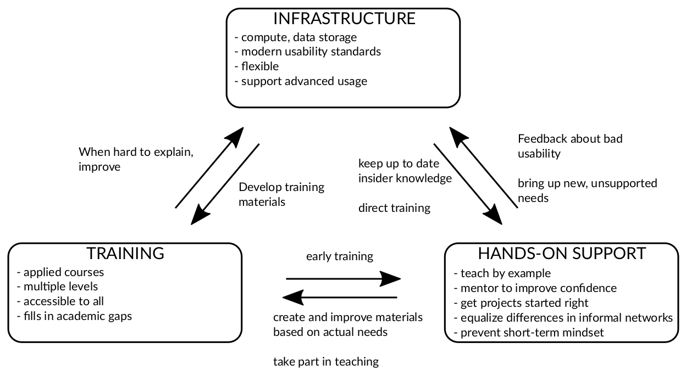
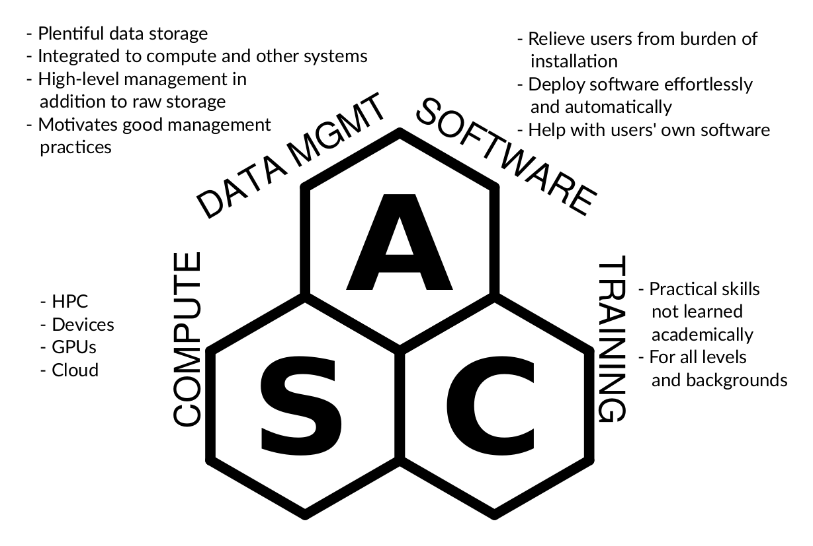

About
=====

Computational research is one of the focus areas in Aalto
University, and **Aalto Scientific Computing** makes that possible.

The **Science-IT** project was founded in 2009 (with roots going back
much further) and has since expanded from high-performance computing
services to a complete package: we provide computation, data
management, software, and training.  Our partnerships with departments
and central IT services allow a streamlined experience from personal
devices to the largest clusters.

To reflect our expanded services, we have rebranded to **Aalto
Scientific Computing** to reflect our greater mission and partners.

Many Centres of Excellence and departments at Aalto
University are using our resources with great success. There are
currently over 1000 user accounts from all six different schools and at least 14
different departments using our resources. Science-IT is administered
from the School of Science with additional university-level funding -
**our HPC services are available to all Aalto University, free of
charge**.

.. toctree::
   :maxdepth: 1

   for-proposals
   join

What we do
----------

We don't just provide computing hardware, but a complete package of
infrastructure, training, and hands-on support.  All of these three
activities feed back into each other to improve the whole ecosystem.

We provide many types of services:

Our components, partners, and collaborators
-------------------------------------------

**Aalto Scientific Computing** serves as a hub of computational
science at Aalto.  We guide researchers to the right service,
regardless of who is providing it.

Science-IT serves as the coordinator, and runs the Triton cluster,
the physical hub of large scale computational and data-intensive research at
Aalto.  As such, we maintain many active collaborations which allow us
to guide researchers to the right resource, regardless of who provides
it.

Science-IT
~~~~~~~~~~

.. toctree::
   :maxdepth: 2

   science-it

Science-IT is the organizational manifestation of Aalto Scientific
Computing.

Science-IT concentrates on mid-range computing and special
resources needed by researchers in the School of Science. With local
resources, we can provide high-quality support and even
research-project-level customization.  Because our resources are
integrated into the Aalto IT environment, with regular local training
in the scientific computing practice to entry-level users, our
resources enjoy an ease of access and lower barrier to entry than, for
example, CSC HPC resources. We are also a basic research
infrastructure, enabling the integration of separately purchased
resources to our cluster and storage environments, with dedicated
access for the purchaser.

Our team is mainly known for providing the :doc:`Triton cluster </triton/index>`, a mid-range
HPC cluster with  ~10000 CPUs, 5PB storage capacity,
Infiniband network, and ~150 NVIDIA GPUs for deep learning and artificial
intelligence research.  We provide a :doc:`Jupyter Notebook </triton/apps/jupyter>` based interface
to enable light computing with less initial knowledge required to make
our services easily accessible to everyone.  Our team also works with
the CS, NBE, and PHYS departments to provide data storage and a seamless
computational research experience.
We maintain http://scicomp.aalto.fi, the central hub for
scientific computing instructions and have a continuous :doc:`training
program </training/index>`, :doc:`Scientific Computing in Practice </news/index>`.

Computer Science, Physics, and Neuroscience and Biomedical Engineering
~~~~~~~~~~~~~~~~~~~~~~~~~~~~~~~~~~~~~~~~~~~~~~~~~~~~~~~~~~~~~~~~~~~~~~

These departments are members of Science-IT, and their local IT staff
provide a great deal of scientific computing support, and in fact all
the Science-IT team above is contained here.  These departments resources
are seamlessly integrated with Aalto's HPC resources.

.. toctree::
   :maxdepth: 1

   cs-it

Partners
~~~~~~~~

We are a leading member of the **Finnish Grid and Cloud Infrastructure
(FGCI)**, a university consortium to support mid-range computing in
universities.  FGCI, via Academy of Finland research infrastructure
grants, funds a large portion of our work.  Thus, we maintain ties to
most other universities in Finland as well as **CSC**, the national
academic computing center.  Through the FGCI, we provide grid
computing access across all of Finland and Europe.

Our team overlaps with the `Departments of Computer Science
<https://cs.aalto.fi/en/>`_, `Neuroscience and Biomedical Engineering
<http://nbe.aalto.fi/en/>`_, and `Applied Physics
<http://physics.aalto.fi/en/>`_.  The IT groups in these departments
provide advanced Triton support.

We maintain close collaboration with **Aalto University IT Services
(ITS)**.  We are not a part of ITS, but work closely with them as the
computational arm of IT Services.  ITS provides the base which we
repackage and build on for many of our services.

Our team maintains ties to **Aalto Research and Innovation Services**
to guide data and research policy.  Triton is an Aalto-level research
infrastructure.  Our staff is involved in research policy making,
including ethical, data security, and data management.  Our team
contains several Aalto **Data Agents**.

We partner with `CodeRefinery <https://coderefinery.org/>`_, a Nordic
consortium to assist in training of scientists, to provide training
and support computational competence.

Who we are
----------

This table lists people supporting Scientific Computing at Aalto
University who considers themselves a part of ASC.  If you want to be
added here, let us know.  We welcome all contributors.  *There is no
Aalto Scientific Computing, just people who want to make computing
better.*

This table is to show the diversity of our skills, not to contact a
certain person.  Always contact us by :doc:`our help channels
</help/index>` for new questions.

.. list-table::

   * *
     * Internal specialties
     * Background skills

   * * Richard Darst
     * Triton admin, RSE, **RSE lead**, online teaching, **documentation**
     * computational physics/chemistry, complex systems, data science

   * * Enrico Glerean
     * Triton admin, RSE, **research ethics**, **personal data**, organizing teaching, statistics
     * neuroimaging methods, statistics, signal processing, responsible conduct of research

   * * Hossein Firooz
     * RSE (earmarked for FCAI)
     * machine learning

   * * Mikko Hakala
     * Triton admin, **team lead**, **strategy and finance**
     * Computational physics, mathematics

   * * Sami Laine
     * Triton admin
     * JupyterHub, software deployment, security and cloud

   * * Thomas Pfau
     * RSE (web)
     * Computational Biology, Metabolic modelling, Linear Programming

   * * Jarno Rantaharju
     * RSE
     * computational physics (quantum mechanics), HPC development and optimization.

   * * Teemu Ruokolainen
     * RSE (earmarked for FCAI)
     * Natural language processing, digital humanities, social sciences

   * * Mira Salmensaari
     * Triton admin, software deployment, teaching
     * Computational physics

   * * Ivan Tervanto
     * Triton admin, **Triton hardware**, **data center**, Applied Physics support, teaching
     * Computational physics, computer science

   * * Yu Tian
     * RSE (generative AI, earmarked for FCAI)
     * Machine learning, medical research

   * * Simo Tuomisto
     * RSE, Triton admin
     * Computational physics, deep learning

   * * Simppa Äkäslompolo
     * Triton admin, **data storage systems**, **Slurm**, hardware and data center, COMSOL
     * Monte Carlo computations, FEM

   * * Susanne Merz
     * RSE
     * Neuroimaging, medical research

Scientific outputs
------------------

Most of the computationally-intensive research outputs from our member
departments use our resources.  In addition, at least the CS and NBE
departments use our data storage for most big data projects.  You may
view our users' research results using `research.aalto.fi (Science-IT
infrastructure section
<https://research.aalto.fi/en/equipment/scienceit(27991559-92d9-4b3b-95ee-77147899d043)/publications.html>`_).

Current research areas
----------------------
Our users come from countless research areas:

* Method development
* Computational materials research
* Network research
* Neuroscience
* Data mining
* Deep learning and artificial intelligence
* Big data analysis

FCCI Tech Seminar series
------------------------

We have an occasional seminar series, open to all, on how we run our
group, :doc:`FCCI Tech </tech/index>`.  Our archive may be interesting
to other scientific computing teams and research software engineers.

.. toctree::
   :maxdepth: 1

   /tech/index

Other
-----

.. toctree::

   sustainability
   web-accessibility
   ../README
