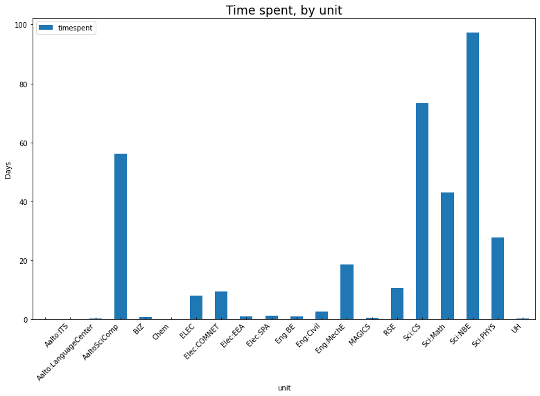
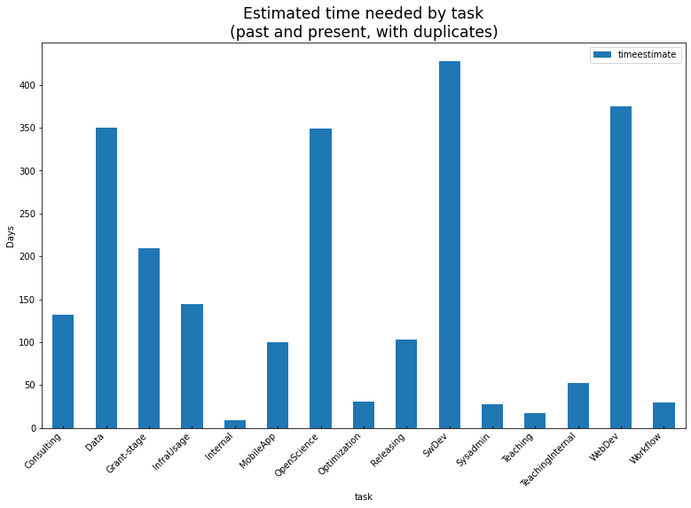
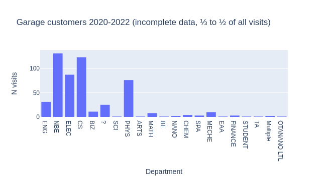
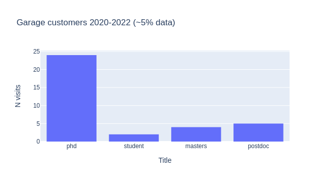

2022 Aalto RSE report
=====================

..
  What people want to know:
  - Is it successful?
  - What is the funding?
  - What is the future?

.. admonition:: Summary

   * The Research Software Engineering service allows researchers to
     take on more ambitious computational projects, and for existing
     projects to be much faster and higher quality.
   * **About 100 projects in a bit less than two years.**
   * **Perhaps 5× return on time spent (time we spent vs time
     researchers saved).**
   * There is no shortage of RSE projects, we could get more if we did
     more outreach (which we don't focus on, since we would then be
     over-capacity).
   * We haven't been able to receive much project funding, due to financial
     difficulties (grant rules make this difficult, we complete most
     projects so fast that the transaction would be too small).
   * We have gotten other long-term support: FCAI has supported a
     dedicated RSE, IT Services has provided funding to extend beyond
     SCI.
   * **Our proposal is that groups receive ~1 month of free service,
     paid with department/school funding.  After that, they should
     find their own funding.**

     * Most projects take well under one month, though, so we still
       focus on basic funding.
     * However, there is a steady stream of longer-term project
       proposals which offer funding.

   * We ask for

     * Continued basic funding at the current levels.
     * Help in finding the researchers and projects who can most
       benefit by this service - can our results better be reported as
       Open Science/societal impact stories - should a small amount of
       RSE time be written into every grant?
     * Recommendations for other schools/departments to join us.

Current status of Aalto RSE
---------------------------

History of Aalto RSE
~~~~~~~~~~~~~~~~~~~~

- December 2018: Idea ("Computational support scholar" postdoc-type
  position)
- December 2019: initial funding from SCI
- October 2020: first hires (permanent)
- Now: three permanent full time staff, continuous stream of
  projects.

Current staff and jobs
~~~~~~~~~~~~~~~~~~~~~~

We are part of Science-IT:

- Three full-time RSEs (the only ones funded by this service)
- One staff leading the RSE group + working as a RSE
- Two other staff with RSE funding from specific projects
- Three other staff focused on infrastructure support, but "we are all
  RSEs anyway"

Types of projects
~~~~~~~~~~~~~~~~~

- **No shortage of projects, also not yet over our capacity.**

  - **We don't advertise too much, since that would take us over our
    limit.**

  - Thus, there is definitely capacity to expand.

Projects fit into two main categories:

- **RSE projects**, take days to months, recorded in our issue
  tracker, includes long-term support.

  - The "classic work" of an RSE.

- **Garage help** are small questions that come up in the "daily
  garage" and answered immediately.

  - Garage is our daily support method, answering small questions.
  - Garage transforms research from "trial and error" to "professional
    quality".

Project stats
~~~~~~~~~~~~~

* 101 researcher projects in ~ 1.75 years.
* **Overall "researcher time saved" is generally 5× "RSE time spent"**
  (self-reports from customers)

   Time spent by department, 2020-2022.  Not all time is recorded.  Figure
   includes only full-time RSE time spent.  Note that we have other
   funding sources that allow us to work outside of SCI, and that
   Science-IT receives general funding to serve the whole university.

   Time estimate (past and present) by type of tasks of all recorded
   projects, including future projects, leads, and canceled ideas, 2020-2022.
   Projects have multiple tasks/benefits and all time is included in
   *all tasks* in this figure.  **Values should only be used as a
   relative comparison.**

Garage stats
~~~~~~~~~~~~

- From October 2020 -- August 2022, about 500 visitors logged (about
  half of visits are recorded).
- Average visit from 30-60 minutes of support.
- Most are answering tech/software questions to help research, and
  teach people to be self-sufficient.
- We also estimate **overall "researcher time saved" is 5× "RSE time spent"**
  (self-reports from customers)

   Garage customers by department, 2020-2022, small sample of data.
   Note that old garage data is extremely sparse, so this is more of a
   current estimate.

   Garage customers by title, small sample of data.  We only recently
   began collecting this data, so it is very incomplete but roughly
   representative.  We only support researchers and staff, students
   not doing research are directed to student resources.

Current and future funding
--------------------------

Financial transaction difficulty
~~~~~~~~~~~~~~~~~~~~~~~~~~~~~~~~

- Original plan: try to get most funding from grants.
- **Finance (for very good reasons) doesn't want to do small
  transactions - minimum 1 month.  Thus, we haven't been able to
  accept much project funding.**

  - Academy/EU rules don't allow easy internal invoicing, so must pay
    salary directly.  This makes more overheads.

- **We need high-level leadership support on this topic.**

Our current project funding policy
~~~~~~~~~~~~~~~~~~~~~~~~~~~~~~~~~~

- **Each research group gets ~1 month of free RSE time sponsored by
  basic funding.**
- **After that, a group is expected to provide their own funding for
  future RSE projects.**
- However, we finish most projects in less than a month.

Future funding plan
~~~~~~~~~~~~~~~~~~~

- **We should maintain at least ~2 FTE of basic funding for the near
  future** for our current number of customers (≈ SCI).

  - Any increases would be used well, though.

- Future hires could be made when project funding is enough to justify
  costs (SCI funding as buffer between project periods)
- A fair number of projects (~10-20) have written months of work
  into submitted grants, funded us, or offered funding.
- More basic funding from other departments?

  - IT Services has provided pilot funding (3 months) to expand to
    other schools, and has been a success.

Future plans
------------

Planned long-term funding
~~~~~~~~~~~~~~~~~~~~~~~~~

* The Finnish Center for AI has committed 4-5 years of full-time RSE
  funding, this was used to hire a third RSE.
* We are currently (September) in planning to get more IT Services
  funding to secure the service beyond SCI.  We will need to carefully
  check how this affects our staffing levels.
* These type of strategic investments seem to practical and scaleable.

Wanted: Better outreach and impact
~~~~~~~~~~~~~~~~~~~~~~~~~~~~~~~~~~

* There is no shortage of projects, and advertising more will surely
  fill us up.
* **But, we can still increase the impact of the projects we select.
  Can you help point the most important projects to us?**
* Especially societal impact (public use of data and algorithms) could
  give us many more projects.

Expansion to other schools
~~~~~~~~~~~~~~~~~~~~~~~~~~

* We expect this service to expand to other schools and universities
  in the future (bringing their own funding).
* This will allow a broader knowledge base from which any individual
  project can draw.
* **Please recommend to other leaders to join us in the RSE concept.**
