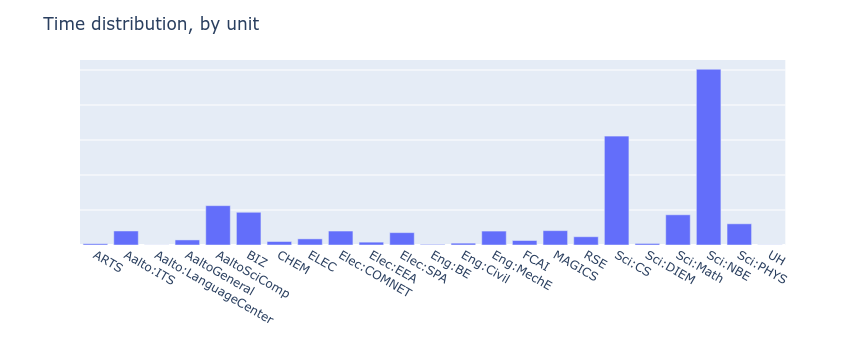
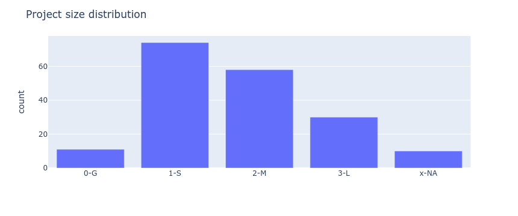
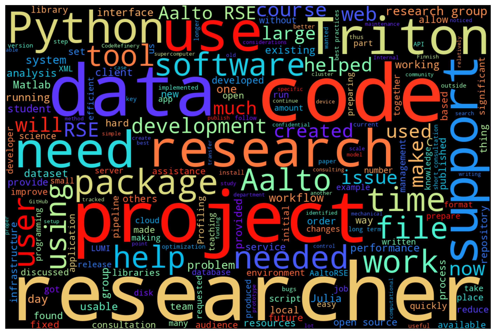
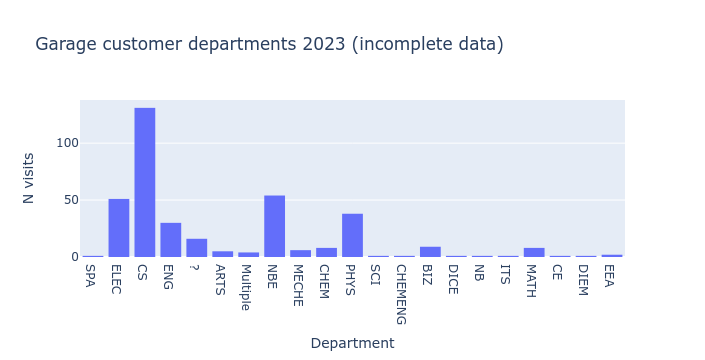
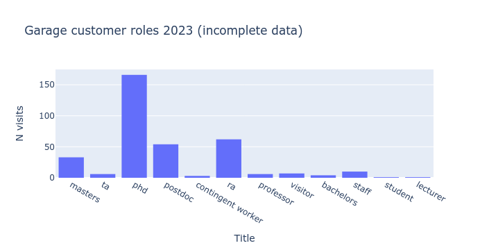
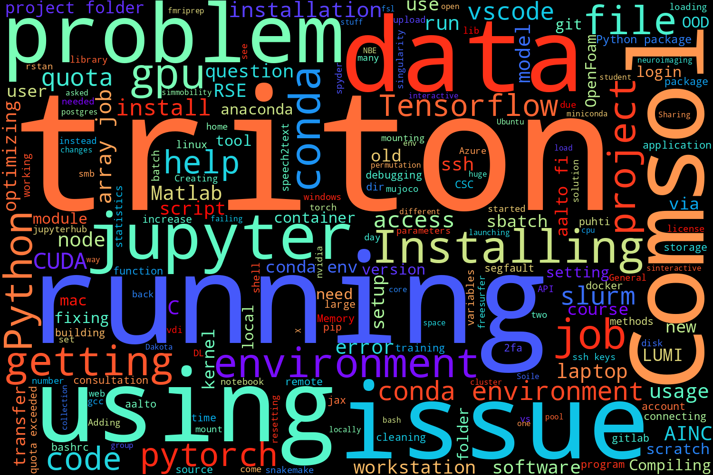

2023 Aalto RSE report
=====================

..
  What people want to know:
  - Is it successful?
  - What is the funding?
  - What is the future?

2023 has continued to be a good year for Aalto RSE: we have grown and
continued to support people.  Most things are similar to last year,
so refer to :doc:`2022` for details: this page will only explain new
things and provide updated statistics.

.. admonition:: Summary

   * Changes from the last report (mid-2022)

     * We have three more staff (project-funded)
     * IT Services provides more funding so that we can support
       computational sciences in non-SCI schools (and also do internal
       projects).

   * Our current status

     * We maintain a good mix of small, immediate support
       (:doc:`SciComp garage </help/garage>`) and longer-term projects
       (:doc:`../portfolio`)
     * Even with little advertisement, we are fully booked (but not
       overwhelmed).
     * **5× time benefit** (time we spend vs time academics save),
       regardless of project size, seems to continue to be true.

   * What we ask

     * Tell academics, who are most in need of scientific computing
       support (the non-experts), about our services.
     * Discussion of how to better align project selection with the
       university's strategy (if others think this is important.)

Current status of Aalto RSE
---------------------------

We have five dedicated staff, of which three are funded directly by
research projects.  There are three other Science-IT staff which
aren't paid by RSE funding but dedicate notable amount of time to the
service.

Types of projects
~~~~~~~~~~~~~~~~~

.. figure:: https://github.com/AaltoSciComp/aaltoscicomp-graphics/blob/master/figures/rse-alignment.png?raw=true
   :align: center
   :width: 400
   :alt: 3x3 grid, axes are "Help you do it", "Do it with you", "Do it
	 for you" and "Programming", "Integration/workflows", "Data"

   One way to classify the types of projects Aalto RSE does.  Real
   examples given.

Project stats
~~~~~~~~~~~~~

A "research software engineer" project, for the purposes of this
section, is something large enough to keep a record within our issue
tracker.

* Number of RSE projects 2020-2023: 187
* Number of new RSE projects, 2023: 46
* Distinct contact people 2020-2023: 51 supervisors, 140 contacts
* Number of departments: 24 (this is slightly broader than Aalto departments)
* Number of distinct schools: 6 (every Aalto school)

   Distribution of projects among different units, 2020-2023.  Keep in mind that
   so far primary funding comes from the School of Science.

.. figure:: 2020-2023-task-time-spent.png
   :alt: Bar graph as described.

   Rough distribution of the types of tasks which we do.

   Size distribution of all tracked projects.  Note that the smallest
   projects are not all rigorously tracked in this system, especially
   the "0-G" (garage) projects.  Sizes are "garage", small, medium,
   large, and "not applicable".

   Word cloud of project summaries.

Garage stats
~~~~~~~~~~~~

Our :doc:`Scientific computing garage </help/garage>` is a daily
session where any researcher at Aalto can drop by and ask us for help.

* 17 distinct units (schools/departments) logged
* Every school represented
* 370 recorded visits
* Not every visit is recorded, perhaps around 50%.

   Departments/units of garage customers.

   Academic roles of garage customers.

   Word cloud of support summaries.

Current and future funding
--------------------------

* Our basic funding remains core Science-IT users: SCI (50%),
  CS/NBE/PHYS (50%)
* IT Services provides funding for both internal ITS projects and
  sponsoring us to support projects in the rest of Aalto University.
* The Finnish Center for AI provides funding for three research
  software engineers, whose time they distribute among different
  projects within Aalto and the University of Helsinki.  They also
  work on AI-related projects found through our normal channels.
* One HPC-related Masters-level course provided funding for RSE
  support of its teaching.
* One other project provides funding as a retainer, for ongoing work
  on its software.
* Various projects have included Aalto RSE support in grants, but
  unfortunately we don't have full record of all of these.

Future funding issues:

* Micro-transactions for small amounts of service is too hard.  We
  finish most projects before they last long enough to make it worth
  taking project funding.  This situation seems to have been accepted,
  and these days we take 1 month as the threshold for project funding.

* Unit-level support seems most scaleable and useful to cover core
  operations.

Future plans
------------

* Our service works well and we don't want to break it.  Keep it going
  like it is now.
* There is probably still a large untapped demand for Aalto RSE in
  other departments.  Further expansions will trigger discussions of
  how far we can scale: for example, by replicating the idea in other
  schools?
* As always, we would like to increase the diversity of our customers
  and get more customers who are not already 
