2024 Aalto RSE report
=====================

..
  What people want to know:
  - Is it successful?
  - What is the funding?
  - What is the future?

In 2024, Aalto RSE has grown compared to 2023, and the work we have
done has grown proportionally.  We remain busy and in the state of
"don't advertise too much since we would go past our tipping point".

.. admonition:: Summary

   * Changes from the last report (2023→2024)

     * We have recruited two more staff members (one internal
       rearrangement, one new hire) to serve as general-purpose RSEs.
     * Tracking time spent on every individual project doesn't seem to
       work with our current projects.  Instead, we'll try to track
       general size of projects to understand the distribution of
       projects among schools, and Halli to understand the money
       flows.
     * Our recent growth hasn't impacted our team cohesiveness yet.

   * Our current status

     * More AI-related projects, but by no means exclusively AI.  All
       of our three prongs (programming, data, workflows) can relate
       to AI.
     * We maintain a good mix of small, immediate support
       (:doc:`SciComp garage </help/garage>`) and longer-term projects
       (:doc:`../portfolio`)
     * Even with little advertisement, we are fully booked (but not
       overwhelmed).
     * **5× time benefit** (time we spend vs time academics save),
       regardless of project size, seems to continue to be true.

   * Future / What we ask

     * As always, help in directing to us the academics who most need
       our services.

     * In order to serve research needs in other schools, we are
       looking into an expansion to other schools.  The ideal case
       would be a hire within another school, which would then work
       with our team but focus on another school.

Current status of Aalto RSE
---------------------------

We have seven dedicated staff, of which three are 100% funded directly by
research projects.  There are four other Science-IT staff which
aren't paid by RSE funding but dedicate notable amount of time to the
service.  There are two Science-IT staff who spend a significant
amount of time on RSE-related projects.

Types of projects
~~~~~~~~~~~~~~~~~

What do we do?  The following figures show the range of activities and
roughly where time is spent

.. figure:: https://github.com/AaltoSciComp/aaltoscicomp-graphics/blob/master/figures/rse-alignment-percentages.png?raw=true
   :align: center
   :width: 400
   :alt: 3x3 grid, axes are "Help you do it" (20%), "Do it with you"
	 (20%), "Do it for you" (60%) and "Programming" (50%),
	 "Integration/workflows" (35%), "Data" (15%)

   One way to classify the types of projects Aalto RSE does, and
   roughly where our time goes.  This isn't precisely measured but
   roughly accurate.  Real examples given within the cells.

.. figure:: https://github.com/AaltoSciComp/aaltoscicomp-graphics/blob/master/figures/support-levels-percentages.png?raw=true
   :align: center
   :width: 400
   :alt: 3x3 grid, axes are "Basic" (15%), "Practical" (50%),
	 "Specialist" (30%), "Research" (5%) and "Programming" (50%),
	 "Integration/workflows" (35%), "Data" (15%).

   How advanced are our projects?  For example, the "basic" level in
   this figure is things which we'd expect people to have learned in
   their fields, but still need help with, while "research" is
   research-level work in projects.
   We help people at all levels, but ideally would like to focus on
   the middle two.  Ideally, "basic" would be handled more at the
   academic program level and "practical" could have some more
   mentoring within research groups, but we realize researchers are
   *very* diverse and not everyone can take the same paths in their
   careers.

There are three main ways our activities are tracked:

* **RSE projects**, bigger activities that are worth adding to our
  internal project tracker.

* **Garage support**, our daily drop-in time where people can ask any
  questions.  This is often the starting point for larger projects.

* The **Triton cluster issue tracker** provides many projects, usually
  related to installation or usage of applications.

2024 seems to have had a greater proportion of large projects, taking
up a larger amount of time and providing more funding.  Our
"basic/project funding" RSEs have done more of these large projects,
while the dedicated funding staff have had many more smaller
AI-related projects.

RSE project stats
~~~~~~~~~~~~~~~~~

A project, for the purposes of this section, is something large enough
to keep a record within our issue tracker.  Many of our activities are
too small for this (see "garage stats" below).

We have realized that with our multitasking and many activities going
on (all interspersed and at unpredictable times, due to academic
schedules), recording individual time spent on each project doesn't
give good data.  Instead, we will track the overall size distribution
of projects and use the finance system to track time spent for funding
matters (which includes our largest projects).  EU projects also
require a separate time tracking system.

* Number of RSE projects 2020-2024: 260
* Number of new RSE projects, 2024: 71
* Distinct contact people 2024: 69 supervisors, 77 contacts
* Number of distinct schools: 5 (all except CHEM)

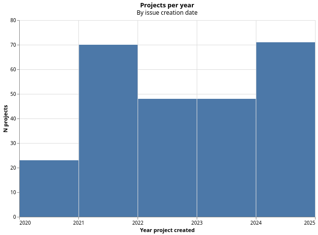

   Projects per year.  The data is interesting, but since it tracks
   "RSE project issues created" and the standard for what should be an
   issue changes over time, it shouldn't be relied on too much.

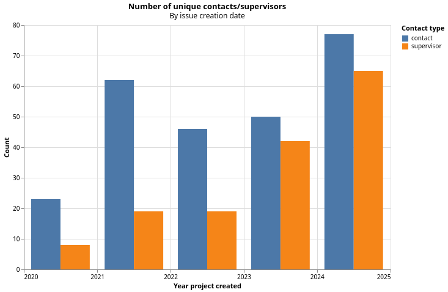

   We see that the general trend for number of contacts is
   increasing.  This data isn't completely accurate, though.

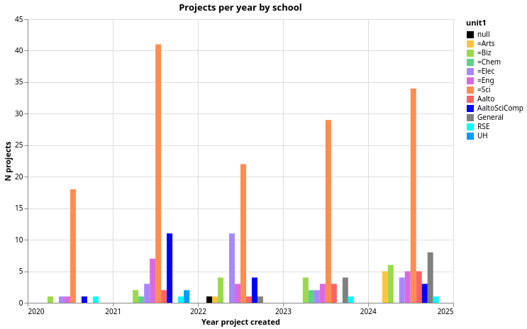
	 always the largest and other schools are becoming more and
	 more represented as time goes on.

   We see that the School of Science continues to be the primary
   customer base, as is expected since it's the only one providing
   basic funding.

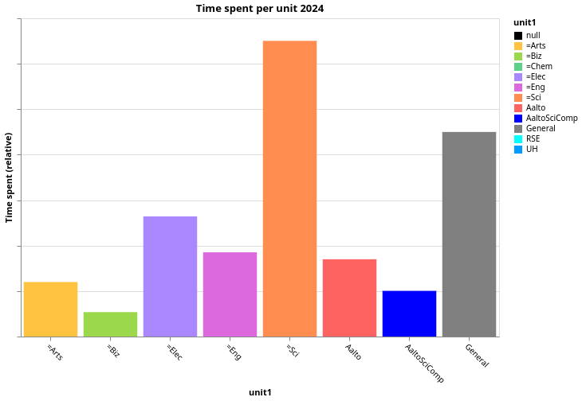
	 around 300 days.

   We also see that most time is going to the School of Science,
   followed by activities that support all Aalto in general, and then
   the School of Electrical Engineering.  Because time is not tracked
   rigorously, this should only be used as a relative measure.

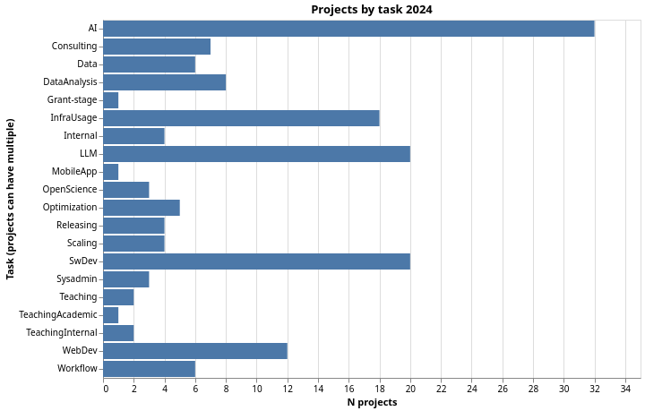
	 and "InfraUsage", and "WebDev".

   "Tasks" are labels for what projects are about - projects can have
   multiple.  This shows roughly the kind of things we do.

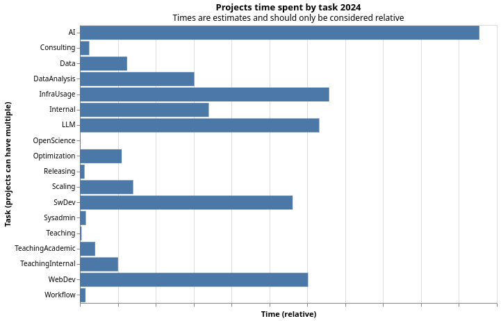
	 categories the same as above.

   Like above, but with the time distribution.  Again, the absolute
   values are not accurate but this shows the relative distribution.

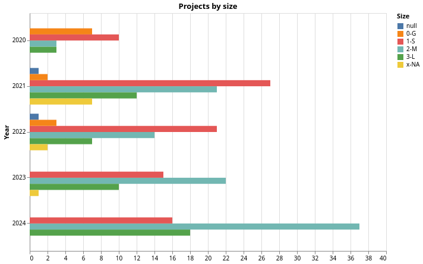
	 progress, there are more and more large projects.

   We see that we are shifting more towards larger projects.  This is
   a real effect, but also "don't bother recording small and garage
   projects" is a big part of it, too.

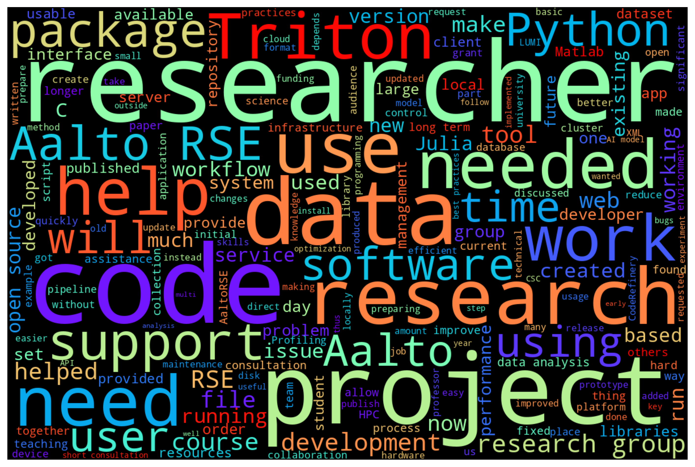

   A word cloud of the one-sentence summaries of projects.

Garage stats
~~~~~~~~~~~~

Our :doc:`Scientific computing garage </help/garage>` is a daily
session where any researcher at Aalto can drop by and ask us for
help.  This is where we meet the most people and has taken over as the
"small project" system.

* 13 distinct departments logged + all six schools.  (We haven't recorded
  full data on everyone's department.).
* Every school represented.
* 542 recorded visits.
* Not every visit is recorded, the total visits is estimated around
  twice as many.

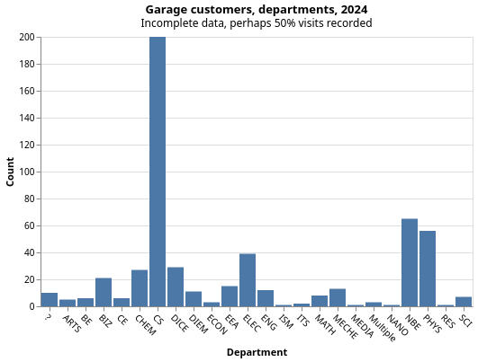

   Departments/units of garage customers.

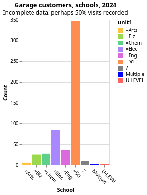

   Schools of garage customers.

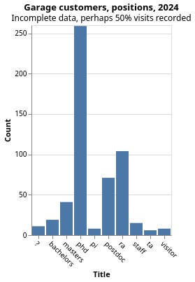

   Academic positions of garage customers.

.. figure:: 2024-garage-wordcloud.png
   :alt: Word cloud

   Word cloud of garage summaries.

Triton issue stats
~~~~~~~~~~~~~~~~~~

We don't have stats here, but many of the RSE-related ones are related
to installation and use of various software.

Funding status
--------------

Our funding has been good: In summary, we had enough paid project
work that we have needed to expand our team, since we were at the
point of not being able to accept new paid projects.  The general
principle remains "There should be less than 2FTE of staff time paid
by basic SCI funding".

IT Services continues to fund work that comes from outside the School
of Science.  There is one new major project that is expected to
provide at least 1FTE/year of projects over the next years.  We have
worked out funding practicalities for EU projects.

The statistics below are a measure of worktime with vacations and sick
leaves distributed equally across the other sources.  1FTE is one
person working for one year.

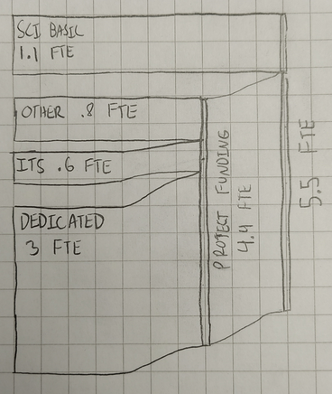

   Summary of funding flow of the RSE service, measured it FTEs of
   funding.  We had 5FTE at the start of the year and 7FTE at the end,
   so the total FTE was 5.5 throughout the year.  Overall, basic
   funding from SCI was 20%, or 1.1 FTE.  This is slightly increased
   because our new hires can't begin their new projects immediately.
   "Dedicated" are staff who are paid 100% by one major funding
   instrument and work for many related projects.

* **Entire year**: 3 FTE paid directly by a research project, not
  listed below.

* **End of September**: (before new hires began) 0.6 FTE basic funding,
  .98 FTE from project funding (.51 FTE from projects directly, .48 FTE from IT
  Services).

* **End of year**: 1.1FTE basic funding, 1.4 FTE from project funding (of
  which .84FTE from projects directly and .58FTE from IT Services)

Future plans
------------

The increase in AI-related research will probably continue to give us
more work in the future, even among our existing research community.

Our two new hires this year will do significant work for a major new
funding instrument, so a lot of their time is already planned to be
funded in the next year.

We are working to bring other schools onboard, so that they can hire
their own research software engineers to serve their communities.  An
example of how this can work can be found in `RSE work rotations
<https://aaltoscicomp.github.io/blog/2024/rse-work-rotations/>`__.

As always, we have a good number of customers from our existing work
community, but there are so many more potential users who don't know
of us.  The academics who don't currently know about us are probably
the ones that need us most.
