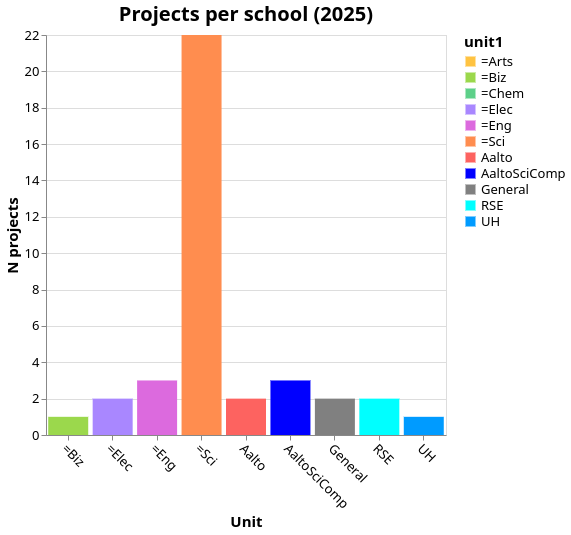
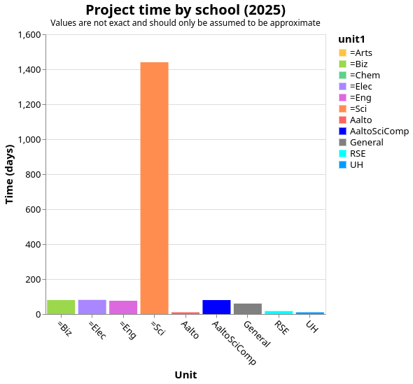
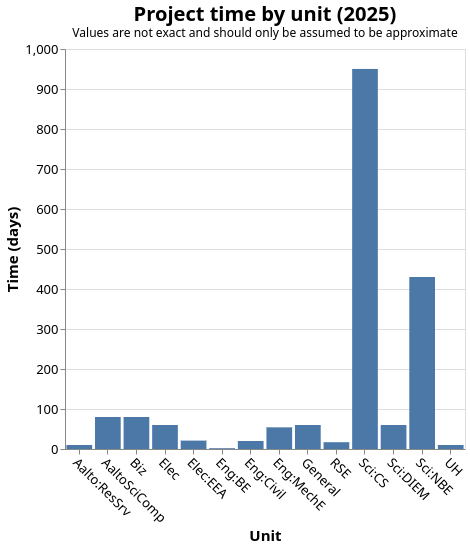
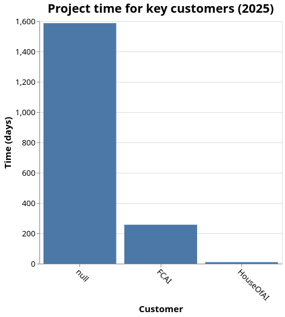
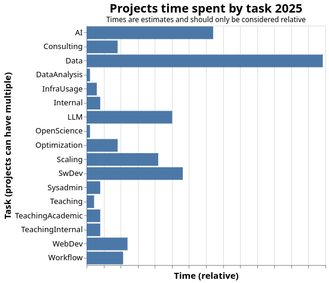
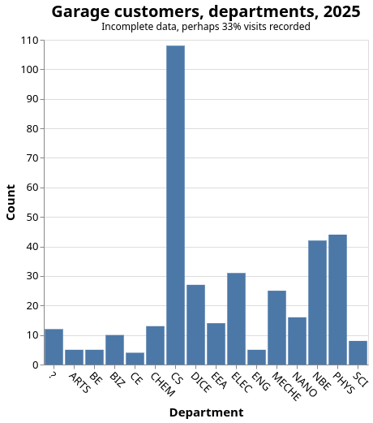
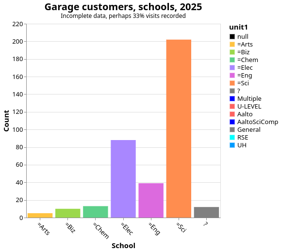
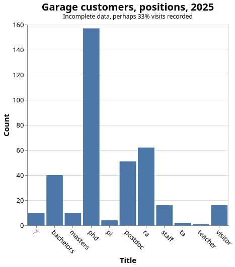

2025 Aalto RSE report
=====================

..
  What people want to know:
  - Is it successful?
  - What is the funding?
  - Who is benefiting?
  - What is the future?

In 2025, Aalto RSE has grow compared to 2025, mainly with even more
focus on AI with significant funding from several AI infrastructure
projects.

.. admonition:: Summary

   TBA

Current status of Aalto RSE
---------------------------

We have continued as in past years, pretty successfully.  During 2025,
we grew from 7 staff to 10 staff with a new Lumi AI Factory grant to
a research group in the CS department.

For more information on the types of projects we do, see the previous
year's report: :doc:`2024`.

Our KPIs
--------

As we have matured, our previous KPIs of "number of projects per year"
isn't appropriate anymore - our projects are becoming larger, and small stuff is being handled in garage.

RSE project stats
-----------------

A "project" is any RSE activity that takes more than a few days and
has significant RSE investment, including taking a leading role.

Note that projects span years, and each project is heuristically
assigned to some year.

   RSE project per primary unit.  SCI dominates, because so far almost
   all funding has been from within SCI.

   Relative times spent.  Time is not exactly measured.

   Relative times spent by unit.  CS provides a vast majority of the
   external funding of the.

   These are customers providing significant funding to the RSE
   service.

   This shows the (relative) times spent on different types of common
   things we do.

	     
Garage support stats
--------------------

"Garage support" is our drop-in "office hour" online every day,
including any other small customer contacts and small projects which
remain the primary responsibility of the customer.  In 2025, we have
emphasized garage as the way we support and record anything smaller
than a "project".

Note: We do not have complete data: we record when we can, but often
miss people.

   Departments/units of garage customers.  While CS is the most
   active, there is a great variety.

   Schools of garage customers.

   Academic position of garage customers.  As expected there is a
   focus on doctoral education, but support extends to all user
   groups.

   Word cloud of descriptions from garage.

Funding stats
-------------
