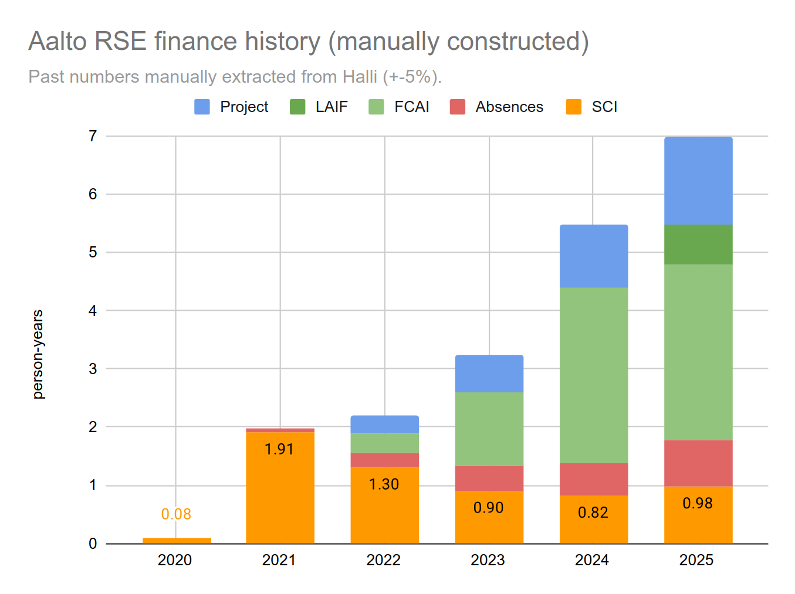
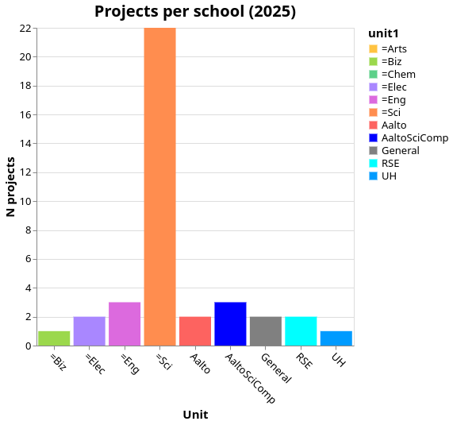
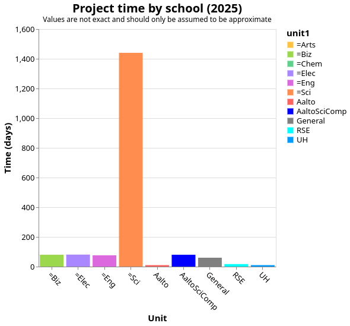
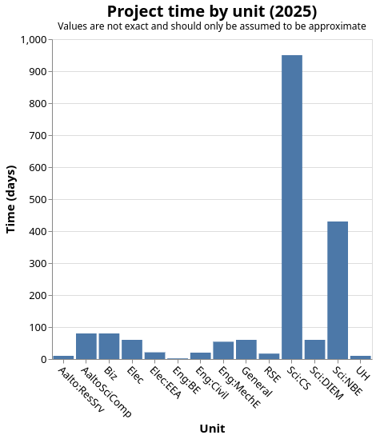
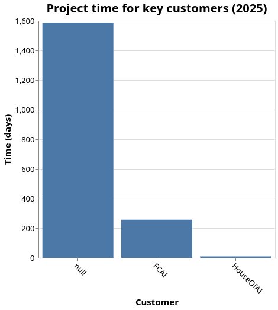
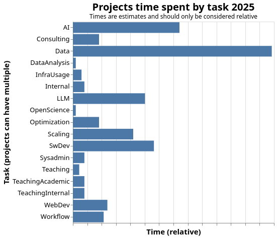
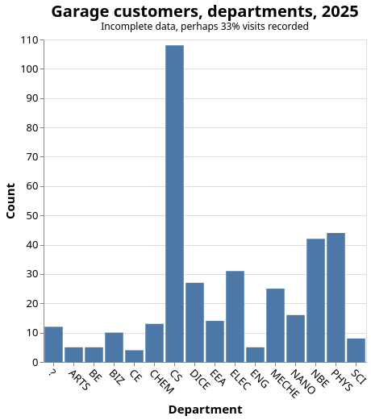
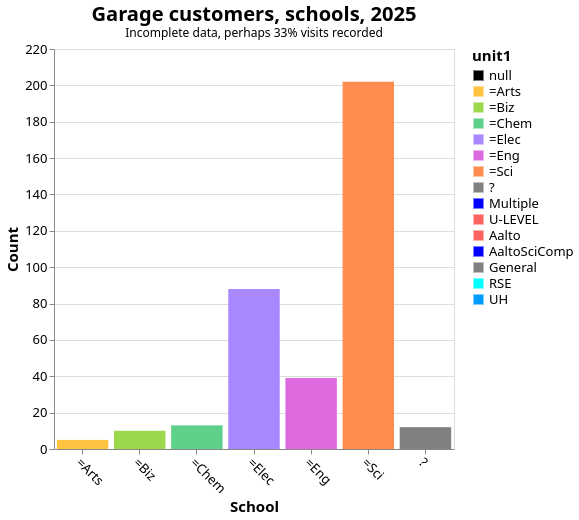
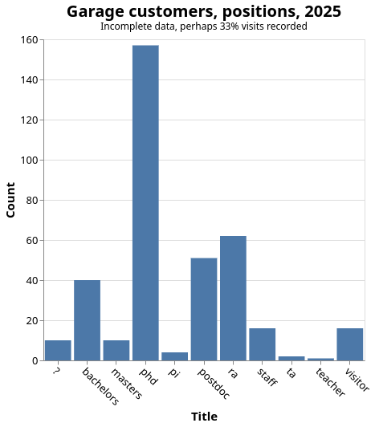

2025 Aalto RSE report
=====================

..
  What people want to know:
  - Is it successful?
  - What is the funding?
  - Who is benefiting?
  - What is the future?

In 2025, Aalto RSE has grow compared to 2025, mainly with even more
focus on AI with significant funding from several major AI projects.

Current status of Aalto RSE
---------------------------

We have continued as in past years, pretty successfully.  During 2025,
we grew from 7 staff to 10 staff with the new staff being hired as
academic staff in the CS department.  This allows us to support a
wider variety of career paths.  We continue to mainly serve
computational research groups, we are increasing getting projects from
outside the School of Science.

Major partnerships include:

* The School of Science
* CS, NBE, PHYS departments
* Aalto Data Agents (Research Services, Open Science and ACRIS team)
* LUMI AI Factory
* IT Services (IT Services for Research, Cloud/AI team)
* AI-DOC (AI doctoral pilot)

Finance
-------

Goal: Basic funding from SCI and its departments remains under 2 FTE,
even as the team grows.  This has been accomplished.

The large amount of AI-related funding has, in some sense, inhibited
the team from finding a more diverse funding base.  While the increase
in computing brought about by AI is here to stay, there is at least
some risk of these dedicated funding sources being reduced in the
future, and it would be wise to find a broader funding base.

One future challenge is to be able to receive funding from small
projects (under one month) with less work.  Right now our current
threshold is one month, but an stakeholder suggested that we should
find a way to receive funding for smaller projects.

   Main funding sources.  Orange is SCI (+ SCI department) basic
   funding.  Blue is that from assorted 3-party sources.  Greens
   represent major AI funding from the Department of Computer Science.
   Red indicates absences, which are recorded separately in financial
   systems and needs further consideration.

Our KPIs
--------

As we have matured, our previous KPIs of "number of projects per year"
isn't appropriate anymore - our projects are becoming larger, and
small work is being handled without separate tracking.
From 20265 we will focus on two types of KPIs:

* Major projects, trackable separately.
* Garage support, tracked only in aggregate and "best-effort".

RSE project stats
-----------------

A "project" is any RSE activity that takes more than a few days and
has significant RSE investment, including taking a leading role.

Note that projects span years, and each project is heuristically
assigned to some year.

   RSE project per primary unit.  SCI dominates, because so far almost
   all funding has been from within SCI.

   Relative times spent.  Time is not exactly measured.

   Relative times spent by unit.  CS provides a vast majority of the
   external funding of the.

   These are customers providing significant funding to the RSE
   service.

   This shows the (relative) times spent on different types of common
   things we do.

Garage support stats
--------------------

"Garage support" is our drop-in "office hour" online every day,
including any other small customer contacts and small projects which
remain the primary responsibility of the customer.  In 2025, we have
emphasized garage as the way we support and record anything smaller
than a "project".

Note: We do not have complete data: we record when we can, but often
miss people.

   Departments/units of garage customers.  While CS is the most
   active, there is a great variety.

   Schools of garage customers.

   Academic position of garage customers.  As expected there is a
   focus on doctoral education, but support extends to all user
   groups.

   Word cloud of descriptions from garage.

Future considerations
---------------------

* "AI" will increase computing demands by lowering the human effort
  required for computing, which will expand our customer base and make
  new challenges.
* Extra funding will make a larger team and more diverse career paths,
  which needs extra attention.
