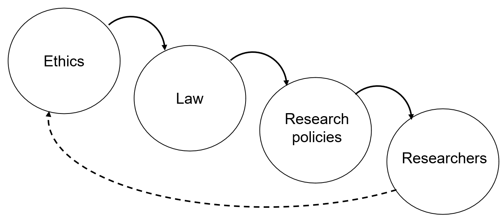

Responsible Computational Research
----------------------------------

Doing research comes with responsibilities, how to make sure the principles of research integrity are translated into scientific computing practices? This page presents a short structured view of ethical and legal considerations in computational research in Europe, with an extra overview of responsible use of generative AI for writing code. **This page is a draft, help us improving it!**.

.. exercise:: Which ethical, moral, or legal issue is making you doubtful about your research?

    Discuss with your peers about what you perceive as a potential issue regarding your research. A good example is **reproducibility** and **validity** of research: Are my results **true** and do they reflect real phenomena? Will others be able to **validate and replicate** my findings with new data/experiments? **Will I be able to re-run the same code/scripts and same data and re-obtain the same results?**

The Normative Cascade
*********************

The normative cascade (`Floridi, 2018 <https://royalsocietypublishing.org/doi/full/10.1098/rsta.2018.0081>`__) summarises how general ethical principles become regulations/laws, which then become research policies which guide our work as researchers. Ethics is not law, and (ideally) ethics drives changes in the law. Finally, society and the scientific community re-defines what (research) ethics should be.

    Redrawn from Floridi, 2018, and re-adapted in the context of ethics, laws, and academic research.

Level 1: Foundational ethical principles in research
====================================================

In the context of research, the `ALLEA - European Code of Conduct for Research Integrity <https://allea.org/code-of-conduct/>`__ defines the core principles of ethics in research:

    * **Reliability**: Ensuring the quality of research, reflected in the design, methodology, analysis, and use of resources. 
    * **Honesty**: Developing, undertaking, reviewing, reporting, and communicating research in a transparent, fair, full, and unbiased way​
    * **Respect**: Towards colleagues, research participants, research subjects, society, ecosystems, cultural heritage, and the environment.​
    * **Accountability**: Accountability for the research from idea to publication, for its management and organisation, for training, supervision, and mentoring, and for its wider societal impacts.​

The ALLEA code of conduct is a short little book that everyone should read before doing any research work. After the principles, the book covers the good research practices, and the violations of research integrity. 

.. exercise:: Exercise: How do the ALLEA principles, good practices, violations map to computational research?

    In small groups, browse the ALLEA code of conduct, pick a few items and write the corresponding good/bad practice in computational research.
    
    .. solution:: 

        A few examples
        
        * When considering Falsification or Fabrication, analysis code could alter or omit data points without justification, to force a certain view on the results which is not scientifically valid. 
        * Plagiarism: when writing code, it is common to reuse other's tool and packages. These tools come with licenses and terms for reuse, if those are not respected and if work of others is not properly accounted for, not only it becomes an ethical violation, it can also have legal repercussions. 

Level 2: EU Legislations and regulations that can affect research
=================================================================

Multiple regulation govern how we should handle research data and the tools we use in research. While this section is not aiming at covering all possible legislations that apply to research, it is important to mention that other legislations that apply to an organisation can also then apply to research (for example, an organisation has the responsibility of repecting the Cybersecurity Directive, and that might affect how researchers use the tools of the organisation).

A few examples worth mentioning:

  * `The General Data Protection Regulation (GDPR) <https://gdpr-info.eu/>`__. Aalto guidelines for `handling personal data in research <https://www.aalto.fi/en/services/how-to-handle-personal-data-in-research>`__.
  * `The Artificial Intelligence Act <https://artificialintelligenceact.eu/>`__. While research on prohibited or high-risk AI systems is legal, the use of certain systems for research can pose risks to the researchers or research subjects. `Aalto guidelines on the AI Act <https://www.aalto.fi/en/services/artificial-intelligence-ai-the-ai-act-and-ai-literacy-at-aalto-university>`__. Article 4 is fundamental for all of us: gaining a sufficient level of AI literacy.
  * `European legislation on open data <https://digital-strategy.ec.europa.eu/en/policies/legislation-open-data>`__: it is worth mentioning that the Commission adopted a list of high-value datasets: geospatial, earth observation and environment, meteorological, statistics, companies and mobility.
  * Export control, dual-use regulations, sanctions compliance: various legislation govern how technological advances can be exported outside Europe, considering the risks associated with the technology, and the current geo-political landscape.

Level 3: National and University-level guidelines (in Finland and Aalto University)
===================================================================================

From the general ethical principles and legislation, national level guidelines follow. While sometimes breaking these guidelines might not have criminal implications, they can have clear impact on reputation and career of the researchers not following them.

  * `TENK guidelines on ethical review <https://tenk.fi/en/advice-and-materials/guidelines-ethical-review-human-sciences>`__. `Aalto guidelines on ethical pre-review <https://www.aalto.fi/en/services/research-ethics-review-research-ethics-committee>`__.
  * `National policies on open science <https://avointiede.fi/en/policies-materials/policies-open-science-and-research-finland>`__, `data protection <https://tietosuoja.fi/tieteellinen-tutkimus>`__, and `research security <https://okm.fi/documents/1410845/215141330/reseach_security_recommendations_Tanskanen.pdf/ea0eb6fb-cabf-9ecb-0c02-1240b9069153/reseach_security_recommendations_Tanskanen.pdf?t=1719296701680>`__.
  * Codes of conduct (e.g. `Aalto Code of Conduct <https://www.aalto.fi/en/aalto-university/code-of-conduct-values-into-practice>`__)
  * Data classification and cybersecurity  (`e.g. from Aalto <https://www.aalto.fi/en/services/general-instructions-for-secure-processing-of-personal-data>`__)

Level 4: Researchers
====================

And finally it is the researcher who need to understand how all the guidelines and laws apply to their work, and how new ways of working can provide better outcomes or might need a new definitions of core principles.

  * Researchers agree on the ~~best~~ -> good enough practices (`Wilson 2017 <https://journals.plos.org/ploscompbiol/article?id=10.1371/journal.pcbi.1005510>`__), and start implementing them
  * Researchers learn and adapt (e.g. how generative AI is changing the way we work)
  * Researchers drive future change 

  
Responsible research in practice 
********************************

So what is the real-world application of ethical and legal standards for computational researchers?

* **Transparency and openness**: `Open science practices <https://avointiede.fi/en>`__, `FAIR principles <https://www.aalto.fi/en/services/fair-data>`__, `FAIR4RS (FAIR for research software) <https://coderefinery.github.io/social-coding/software-citation/>`__
* **Reproducibility and documentation**: `Version control <https://coderefinery.github.io/git-intro/>`__, `workflow tools <https://coderefinery.github.io/reproducible-research/workflow-management/#workflow-tools>`__, `reproducible computational environments <https://coderefinery.github.io/reproducible-research/dependencies/>`__ (conda, venv, containers), `reusability of tools <https://coderefinery.github.io/modular-type-along/>`__
* **Data protection and cybersecurity**: Use the right system for the type of data you are working with; "ignorance of the law is no excuse"
* **Accountability**: Internal logging, reproducible steps / reproducible results, research governance, fair authorship and citations

.. figure:: images/continuum_best_practices.png
    :width: 99%
    :align: center
    :alt: Best/good enough practices in computational research

    There are many different types of "best" practices to adopt. We all struggle to be on the right of this figure, but being in the middle is good enough... for sure you want to avoid being on the red side of this. Figure from `"Getting started with reproducibility in research!" <https://www.aalto.fi/en/open-science-and-research/getting-started-with-reproducibility-in-research>`__.

Cybersecurity: Classification of Information
============================================

Cybersecurity is the practice of **protecting data, systems, networks, and software from unauthorized access, attacks, damage, or disruption**. ​ It involves implementing a broad range of strategies and technologies to secure the digital environment, from individual software components to large interconnected infrastructures. ​

Effective cybersecurity ensures that sensitive data remains protected, systems function reliably, and unauthorized parties are blocked. ​

  * **C – Confindentiality**: sensitive information is only accessible to those authorized to see it ​
  * **I – Integrity**: ensures the accuracy and consistency of information​
  * **A – Availability**: ensures that information, systems, and models are accessible when needed​

Data (and code) can have different levels of **classification of information**.

  * Public:

    * Publications​
    * Open data (CC*)​
    * Open source software​
    * Other content made public (social media posts, lectures on YouTube)​

  * Internal:
  
    * Drafts​
    * Team notes, meetings data​
    * Pages that require authentication​
    * Project code, software, scripts​

  * Confidential:
  
    * Research data with personal data​
    * Trade secrets​
    * Research proposals​
    * Any other file that requires only a specific group of individuals to have access to​  

  * Secret:
  
    * Data that is required to be secret (e.g. secondary health data, high risk research projects)​
    * Sensitive research data that requires strong protection (e.g. as a result of a DPIA).​

​
**Which storage/computing system is good for what?**

Rules of thumb for secure storage and computing with the systems provided by your University/organisation (please check your university guidelines of course):
  * If it does not require authentication: only public data
  * If it has single factor authentication (e.g. login and password), then it might be good for internal information.
  * If it has​ multi factor authentication, then it might be good for confidential data (examples at Aalto/CSC: Triton Cluster, Teamwork, Allas)
  * If it has MFA and it is not accessible from the internet, then it might be good for secret data (examples at Aalto/CSC: SECDATA, CSC Sensitive Data Services)

Unsure? Get in touch with your local admins/experts/support team.

Generative AI and Emerging Challenges
=====================================

Generative AI tools (usually based on large language models, such as ChatGPT, Claude, Gemini) is a powerful tool that can be used for writing software, empowering everyone with the possibility to convert ideas (prompts) into actual code. When automation comes into play, there are suddenly more risks that can be introduced in your workflow, unless there is careful review of what is generated. 

New risk dimensions for responsible computational research (and data security):

* **Bias and Fairness** in generated content and training data: most models are trained on "anything we can scrape". Your niche case might be not present in the training dataset: will you get a wrong answer? Old (wrong) methods might still be very frequent in the training data, but it does not mean that they are right.
* **Attribution and originality**: how can I find the right references for what I am generating? 
* **Intellectual property and licensing issues**: how can I know that the code I generate with ChatGPT is not verbatim copied from a library that makes it mandatory to be cited or to adopt a certain software licence?
* **Data leakage and confidentiality risks**: there is no "cloud" it's just someone else's computer. Be careful with the data you input in that computer ("we promise you your data is safe, trust us" -> data breach happens) ("`30% of popular AI chatbots share data with third parties <https://surfshark.com/research/chart/ai-chatbots-privacy>`__")
* **Risks of automation and lack of explainability**: the more you automate, the more you need to test that the automation works. If your results are just the output of an AI system, how do you ensure reproducibility and explainability?
* **Regulatory uncertainty and ethical concerns**: how was the training data obtained? Is it legal that they used all the possible data from the whole internet? What is the impact on the environment? What is the impact on all those exploited workforce who annotates and improves these AI models/systems? Are open-source models actually open source? (spoiler: `not open at all! <https://dl.acm.org/doi/10.1145/3630106.3659005>`__)
* **Dependence, anxiety, burnout**: these tools are intentionally "humanised" to act like assistants and empower you, up to the point that you cannot do your work anymore without them (or maybe it is just a tool? We need more studies: `see ref <https://www.sciencedirect.com/science/article/pii/S030646032500084X>`__)
* **Cybersecurity risks**: Generated code with "hallucinations" can introduce cybersecurity risks (`reference <https://arxiv.org/abs/2501.19012>`__)
* There is surely more... let's expand this list.

Conclusion
**********

Ethical and responsible research is not a constraint, it is an enabler of robust, reproducible, impactful, and trustworthy science. The path toward "best practices" is complex and non-linear; only through open discussion and reflection on our practices can we collectively adopt the most ethical and effective approaches for doing research. To learn about many of these responsible practices in computational research the `CodeRefinery workshop <https://coderefinery.org/workshops/upcoming/>`__ covers version control, reproducibility, testing, documentation, and more.

Further references
******************
* `Aalto University Research Services YouTube channel (many videos on GDPR in research, responsible AI, research ethics, scraping, registered reports) <https://www.youtube.com/@aaltoresearchservices>`__
* `Vastuullinentiede.fi (Responsible Research) <https://vastuullinentiede.fi/en>`__
  