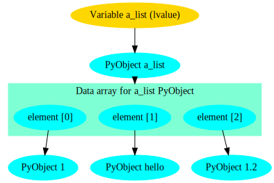
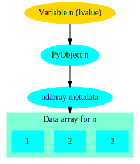
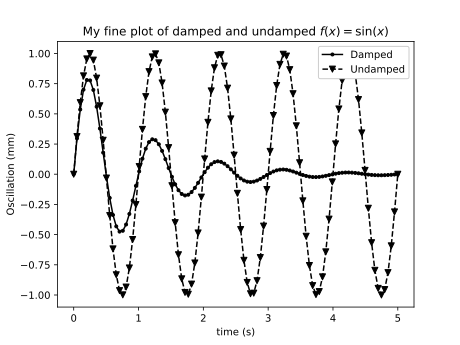

===============================
Python for Scientific Computing
===============================

Abstract
========

Python is a modern, object-oriented programming language, which has
become popular in several areas of software development. This course
discusses how Python can be utilized in scientific computing. The
course starts by introducing the main Python package for numerical
computing, NumPy, and discusses then SciPy toolbox for various
scientific computing tasks as well as visualization with the
Matplotlib package.

Motivation
==========

Why Python
----------

Python has become popular, largely due to good reasons. It's very easy
to get started, there's lots of educational material, a huge amount of
libraries for doing everything imaginable.  Particularly in the
scientific computing space, there is the Numpy, Scipy, and matplotlib
libraries which form the basis of almost everything.  Numpy and Scipy
are excellent examples of using Python as a glue language, meaning to
glue together battle-tested and well performing code and present them
with an easy to use interface.  Also machine learning and deep
learning frameworks have embraced python as the glue language of
choice.  And finally, Python is open source, meaning that anybody can
download and install it on their computer, without having to bother
with acquiring a license or such.  This makes it easier to distribute
your code e.g. to collaborators in different universities.

Why not Python for Scientific Computing
---------------------------------------

While Python is extremely popular in scientific computing today, there
are certainly things better left to other tools.

- Implementing performance-critical kernels.  Python is a **very**
  slow language, which often doesn't matter if you can offload the
  heavy lifting to fast compiled code, e.g. by using Numpy array
  operations.  But if what you're trying to do isn't *vectorizable*
  then you're out of luck.  An alternative to Python, albeit much less
  mature and with a smaller ecosystem, but which provides very fast
  generated code, is *Julia*.

- Creating libraries that can be called from other languages.  In this
  case you'll often want to create a library with a C interface, which
  can then be called from most languages.  Suitable languages for this
  sort of task, depending on what you are doing, could be Rust, C,
  C++, or Fortran.

- You really like static typing, or functional programming
  approaches. *Haskell* might be what you're looking for.

Python 2 vs Python 3
--------------------

There are two slightly incompatible versions of Python being used
today, 2 and 3.  Most large projects have supported 3 for a long time
already, and have announced dropping Python 2 support for future
versions (or have already done so), so at this point you should use
version 3 unless you're working on an existing project that for some
reason hasn't yet been ported to version 3.  Accordingly, in this
course we will use Python 3. For more info, see `Python 3
statement <https://python3statement.org/>`_ by many other the major
projects.

Practical details
=================

The instructor will use the ``anaconda3/latest`` module available on
triton.  However, if you have Python 3 with the usual scientific
libraries installed locally on your laptop, you should be able to use
that as well, if you prefer.

For interactively testing things in Python, you can use a Jupyter
notebook, or the ``ipython`` shell.  For writing Python code you will
need a text editor or IDE; Jupyter Lab does have one, if you prefer to
work in a browser based environment. Popular free programming text
editors or IDE's with good Python support include:

- Emacs
- Vim
- VS Code
- Spyder
- Eclipse + PyDev
- PyCharm

You're not expected to know much Python at the start of the course,
but a little bit of programming proficiency is needed as a
prerequisite.

Although not necessary for this course, knowledge of a version control
system is useful when programming (or writing papers with LaTeX or
other text-based formats).  The most common and powerful version
control system today is git.  To get started with git, see our list of
`Git tutorials </scicomp/git>`.

The course focuses on hands-on demonstrations and exercises rather
than lectures.

Introduction to Python
======================

If you are not familiar with Python, a *very* short introduction;
first, the builtin scalar and collection types:

Scalars
-------

Scalar types, that is, single elements of various types:

::

   i = 42       # integer
   i = 2**77    # Integers are arbitrary precision
   g = 3.14     # floating point number
   c = 2 - 3j   # Complex number
   b = True     # boolean
   s = "Hello!" # String (Unicode)
   q = b'Hello' # bytes (8-bit values)

Collections
-----------

Collections are data structures capable of storing multiple values.

::

   l = [1, 2, 3]                      # list
   l[1]                               # lists are indexed by int
   l[1] = True                        # list elements can be any type
   d = {"Janne": 123, "Richard": 456} # dictionary
   d["Janne"]
   s = set()                          # Set of unique values

Control structures
------------------

Python has the usual control structures, that is conditional
statements and loops:

::

   x = 2
   if x == 3:
       print('x is 3')
   elif x == 2:
       print('x is 2')
   else:
       print('x is something else')

While loops loop until some condition is met:

::

   x = 0
   while x < 42:
       print('x is ', x)
       x += 0.2

For loops loop over some collection of values:

::

   xs = [1, 2, 3, 4]
   for x in xs:
       print(x)

Often you want to loop over a sequence of integers, in that case the
``range`` function is useful:

::

   for x in range(9):
       print(x)

Another common need is to iterate over a collection, but at the same
time also have an index number. For this there is the ``enumerate``
function:

::

   xs = [1, 'hello', 'world']
   for ii, x in enumerate(xs):
       print(ii, x)

Functions and classes
---------------------

Python functions are defined by the ``def`` keyword. They take a
number of arguments, and return a number of return values.

::

   def hello(name):
       """Say hello to the person given by the argument"""
       print('Hello', name)
       return 'Hello ' + name

Classes are defined by the ``class`` keyword:

::

   class Hello:
       def __init__(self, name):
           self._name = name
       def say(self):
           print('Hello', self._name)

Python type system
------------------

Python is strongly and dynamically typed.

Strong here means, roughly, that it's not possible to circumvent the
type system (at least, not easily, and not without invoking undefined
behavior).

::

   x = 42
   type(x)
   x + "hello"

Dynamic typing means that types are determined at runtime, and a
variable can be redefined to refer to an instance of another type:

::

   x = 42
   x = "hello"

*Jargon*: Types are associated with rvalues, not lvalues. In
statically typed language, types are associated with lvalues, and are
(typically) reified during compilation.

Organizing Python code
----------------------

Start Python scripts with

::

   #!/usr/bin/env python3

This ensures you get the correct python3 for the environment you are
using.

In general, don't put executable statements directly into the top
level scope in your files (modules), as this code is then run if you
try to import the module.

Instead, use this common idiom:

::

   if __name__ == '__main__':
       # your code goes here

When developing code it's often convenient to be able to reload a
module into your IPython (or IPython notebook) session without having
to restart the entire session. This can be done with the ``reload``
function:

::

   from importlib import reload
   import foo
   foo.bar()
   # Edit foo.py
   reload(foo)
   foo.bar()

Exercise 1.1
------------

Who needs numpy anyway? Implement matrix multiplication with nested
lists as your matrix representation. *Hint for beginners*: Create one
function

::

   def creatematrix(n, m):
       # ...

which creates an NxM matrix filled with random values
(e.g. random.random()). Then create another function

::

   def matrixmult(a, b):
       # ...

which multiplies together two matrices a and b.

Exercies 1.2
------------

Lets continue with the previous example, and add some object oriented
scaffolding around our matrix code.  Create a Matrix class with a
constructor to create the random matrix, and overload the '*' operator
to multiply two Matrix instances. Reuse the code from the previous
exercise.

Exercise 1.3
------------

The essence of science is experiment and measurement.  So lets measure
our matrix multiplication implementation, and calculate how fast it
can multiply matrices, in terms of "Gflops/s" (Giga floating point
operations per second). *Hint*: A "flop" is a floating point multiply
or addition/subtraction.  First figure out of many flops are needed to
multiply two matrices. Then you need to time it; for this you can use
the IPython magic %timeit command. And finally, equipped with this
information, you can calculate a Gflops/s score for you multiplication
method.

Exercise 1.4
------------

Basic file I/O. Run the following python snippet to create a file
``pangrams.txt``:

::

   with open('pangrams.txt', 'w') as f:
       f.write("""The quick brown fox jumps over the lazy dog
   Sphinx of black quartz, judge my vow
   The dog ate my homework
   Pack my box with five dozen liquor jugs
   """)

Next, create Python code to read that file, and check each line
whether it's a pangram. A pangram is a sentence to uses all the
letters of the alphabet.

Enter NumPy
===========

Introduction
------------

The NumPy package provides a N-dimensional array type, and syntax and
utility functions for working with these arrays.

In contrast to a python list, a numpy array can only hold elements of
the same type. The element type can be seen via the 'dtype' attribute.

::

   import numpy as np
   a = np.array(((1,2,3),(4,5,6)))
   a.dtype
   a[0, 0] = "hello"  # error!
   a[0, 0] = 2**100    # error!

What these restrictions buy you is that the memory layout of a numpy
array is very efficient, similar to what you see in low level
languages like C or Fortran.  This means operating on these arrays is
very efficient; in fact, much of the speed advantage of numpy comes
from the fact that array syntax is implemented in fast C code.

Due to the memory layout of numpy being compatible with C and Fortran,
numpy arrays allows one to use functionality written in these other
languages.  Much of the SciPy ecosystem (NumPy, SciPy, etc.) consist
of python wrappers around widely used and battle-tested numerical
libraries written in C or Fortran such as LAPACK and BLAS.

The Python list

::

   a_list = [1, "hello", 1.2]

has roughly the following layout in memory:

In contrast, the NumPy array

::

   n = np.array((1,2,3))

has the memory layout like

Exercise 2.1
------------

1. In the example above we saw that ``2**100`` was too large. What is
   the default datatype of a numpy integer array if we don't
   explicitly specify some type, and what is the largest possible
   integer we can store in such an element.

2. What is the smallest negative element (that is, the largest
   absolute value of a negative number)?  Is it different from the
   largest positive number, and if so, why?

3. What is the absolute value of the smallest negative element? Why?

Other ways of creating NumPy arrays
-----------------------------------

There are many different ways to create NumPy arrays, here's a few of
the most common ones:

::

   np.zeros((2, 3))      # 2x3 array with all elements 0
   np.ones((3, 2), bool) # 3x2 boolean array
   np.arange(3)          # Evenly spaced values in an interval
   np.linspace(..)       # similar to above

NumPy array slicing syntax
--------------------------

NumPy provides a convenient array syntax to reference subarrays,
similar to MATLAB for Fortran.

::

   a[low:high:step]

returns the array elements in the range ``[low, high)`` with a stride
of ``step``. Equivalently for multidimensional arrays.  For
multidimensional arrays NumPy by default stores arrays in row-major
order, like C. Note that this is in contrast to e.g. Fortran, MATLAB
or Julia that use a column-major layout.

Using array syntax efficiently is **key** to using NumPy in a fashion
that leads to short as well as efficient code.

NumPy also provides so-called *advanced indexing*, where you can
select elements with a list of indices.

::

   a = np.zeros((3, 3))
   b = a[(0, 1), (1, 1)]
   b[0] = 1    # Will this modify a?

Views vs. copies
----------------

When slicing an array, you **DO NOT** get a copy of those elements,
but rather a *view*.  That is, the data elements are the same as in
the original array

::

   a = np.ones((2, 2))
   b = a[1, 1:2]
   b[0] = 2

Views rather than copies is more efficient, particularly for large
arrays, but they can sometimes be confusing. Be careful!

If you do need a copy, NumPy arrays have a ``copy`` method to create a
copy rather than getting a view.

**NOTE** With advanced indexing, you always get a copy!

Array shape and size
--------------------

NumPy arrays have a shape and size attribute.

::

   a = np.zeros((2,3))
   a.size               # Number of elements
   a.shape              # shape tuple

We can modify the shape of an array with the ``reshape`` or ``resize``
methods. Or for the special case of flattening an array to a 1D array,
``ravel``.

Combining, splitting and rolling arrays
---------------------------------------

For combining multiple arrays into a larger array, see the
``concatenate``, ``stack``, ``block``, and the more specialized
variants ``hstack``, ``vstack``, ``dstack``.

Similarly, for splitting an array into multiple parts, there's
``split``, ``hsplit``, ``vsplit``.

To roll an array, that is shift the elements along a give axis, use
``roll``.

Exercise 2.2
------------

Create an array ``x`` of 100 evenly spaced numbers in the range
[-2*pi, 2*pi].

Next, create an array ``y``, where each element is the ``sin`` of each
element in the previously created array.

Then, figure out the indices where the array ``y`` changes sign. What
are the ``x`` values for these indices?

NumPy I/O
---------

NumPy has functionality for saving and loading NumPy arrays from
files.  For reading/writing textfiles there is ``loadtxt`` and
``savetxt``. See also ``genfromtxt`` with more sophisticated handling
of missing values etc.

For large arrays, it's faster to use a binary format. For these NumPy
defines a ``.npy`` format. Loading and saving these files can be done
with the ``load`` and ``save`` methods.  There's also the ``.npz``
format, which is a zip archive containing several numpy ndarrays in
one file. ``.npz`` format files can be read/written with ``load``,
``savez`` and ``savez_compressed`` methods. This is a good choice for
temporary or intermediate files such as checkpoints etc. Note that the
format is Numpy-specific, and other languages might not easily be able
to read it. Similarly, for long-term archiving other formats might be
a better choice.

Random Numbers in NumPy
-----------------------

The ``numpy.random`` module contains functionality to create
pseudorandom numbers following different distributions.

Linear algebra in Numpy
-----------------------

The ``dot`` method provides a generalized dot product. It can compute
dot products of 1D vectors, matrix-vector products as well as
matrix-matrix products.  It is an interface to the famous BLAS
library, of which multiple highly optimized versions exist.  The
``numpy.linalg`` module contains interfaces to the most common linear
algebra operations, such as calculating eigenvalues, Cholesky and
singular value decompositions, solving linear systems, least squares,
(pseudo)inverse. This module is an interface to the LAPACK library
(which in turn builds on top of BLAS).

Exercise 2.3
------------

Remember our first exercise, implementing matrix multiplication? Now
do the same, but use NumPy arrays and the ``dot`` method. Compare
performance to the code you wrote yourself earlier, using the IPython
%timeit macro.

Exercise 2.4
------------

Here's a number of quick numpy exercises to get you a feel of numpy
functionality, index manipulation etc.

1. Reverse a vector. Given a vector, reverse it such that the last
   element becomes the first, e.g. [1, 2, 3] => [3, 2, 1]

2. Create an identity matrix of size 4x4.

3. Create a 2D array with zeros on the borders and 1 inside.

4. Create a random array with elements [0, 1), then add 10 to all
   elements in the range [0.2, 0.7).

5. What is ``np.round(0.5)``? What is ``np.round(1.5)``? Why?

6. In addition to ``np.round``, explore ``np.ceil``, ``np.floor``,
   ``np.trunc``. In particular, take note of how they behave with
   negative numbers.

7. Recall the identity :math:`\sin^2(x) + \cos^2(x) = 1`. Create a
   random 4x4 array with values in the range [0, 10). Now test the
   equality with ``np.equal``. What result do you get with
   ``np.allclose``instead of ``np.equal``?

8. Create a 1D array with 10 random elements. Sort it.

9. What's the difference between ``np_array.sort()`` and
   ``np.sort(np_array)``?

10. For the random array in question 8, instead of sorting it, perform
    an indirect sort. That is, return the list of indices which would
    index the array in sorted order.

11. Create a 4x4 array of zeros, and another 4x4 array of ones. Next
    combine them into a single 8x4 array with the content of the zeros
    array on top and the ones on the bottom.  Finally, do the same,
    but create a 4x8 array with the zeros on the left and the ones on
    the rigth.

More quick NumPy exercises like this one `over here
<https://www.labri.fr/perso/nrougier/teaching/numpy.100/>`_.

Exercise 2.5
------------

The topic of this exercise is ``np.einsum`` which implements the
'Einstein summation convention'.  The `Einstein summation convention
<https://en.wikipedia.org/wiki/Einstein_notation>`_ is a commonly used
when working with tensors, but can also be useful for succintly
representing array expressions.

For instance, matrix multiplication can be expressed as

.. math:: C^i_k = A^i_j B^j_k

Implement this with the help of ``np.einsum``.

Einstein notation is also available in pytorch and tensorflow. For
more information about Einstein notation in NumPy see

- `A basic introduction to NumPy's einsum <http://ajcr.net/Basic-guide-to-einsum/>`_
- `Einsten Summation in NumPy <https://obilaniu6266h16.wordpress.com/2016/02/04/einstein-summation-in-numpy/>`_
- `Einsum is all you need - Einstein summation in deep learning <https://rockt.github.io/2018/04/30/einsum>`_

SciPy
=====

SciPy is a library that builds on top of NumPy. It contains a lot of
interfaces to battle-tested numerical routines written in Fortran or
C, as well as python implementations of many common
algorithms. Briefly, it contains functionality for

- Special functions (Bessel, Gamma, etc.)
- Numerical integration
- Optimization
- Interpolation
- Fast Fourier Transform (FFT)
- Linear algebra (more complete than in NumPy)
- Sparse matrices
- Statistics
- More I/O routine, e.g. Matrix Market format for sparse matrices,
  MATLAB files (.mat), etc.

Exercise 3.1
------------

Using scipy, calculate the integral of the function ``sin`` in the
interval ``[0, pi]``, and compare with the analytical result.

Exercise 3.2
------------

Use the SciPy sparse matrix functionality to create a random sparse
matrix with a probability of non-zero elements of 0.05 and size 10000
x 10000. The use the SciPy sparse linear algebra support to calculate
the matrix-vector product of the sparse matrix you just created and a
random vector. Use the %timeit macro to measure how long it
takes. Does the optional ``format`` argument when you create the
sparse matrix make a difference?

Then, compare to how long it takes if you'd instead first convert the
sparse matrix to a normal NumPy dense array, and use the NumPy ``dot``
method to calculate the matrix-vector product.

Can you figure out a quick rule of thumb when it's worth using a
sparse matrix representation vs. a dense representation?

Matplotlib
==========

Matplotlib is the 'standard' Python plotting library. It is quite
full-featured, and provides a MATLAB-like plotting API.

To use it, typically you start with

::

   import matplotlib.pyplot as plt
   # ...
   x = linspace(-4, 4)
   plt.plot(x, np.sin(x))
   plt.show()

When using Jupyter notebooks, use the magic

::

   %matplotlib inline

which will cause matplotlib plots to appear inline in the
notebooks. Very convenient for quick analysis!

Matplotlib has two slightly different interfaces, a state machine
interface similar to MATLAB and an object based interface. The state
machine interface is quick and easy to get started, but since it's
based on hidden global state behind the scenes, for more complex stuff
it might get confusing. Below is an example using the state machine
interface.

::

   import numpy as np
   import matplotlib.pyplot as plt

   x = np.linspace(0.0, 3.0)

   y1 = np.cos(2 * np.pi * x) * np.exp(-x)
   y2 = np.cos(2 * np.pi * x)

   plt.subplot(2, 1, 1)
   plt.plot(x, y1, 'o-')
   plt.title('A tale of 2 subplots')
   plt.ylabel('Damped oscillation')

   plt.subplot(2, 1, 2)
   plt.plot(x, y2, '.-')
   plt.xlabel('time (s)')
   plt.ylabel('Undamped')

   plt.show()

And here is the same thing, but using the object-based interface

::

   import numpy as np
   import matplotlib.pyplot as plt

   x = np.linspace(0.0, 3.0)

   y1 = np.cos(2 * np.pi * x) * np.exp(-x)
   y2 = np.cos(2 * np.pi * x)

   fig = plt.figure()
   ax = fig.add_subplot(211)
   ax.plot(x, y1, 'o-')
   ax.set_title('A tale of 2 subplots, OO style')
   ax.set_ylabel('Damped oscillation')

   ax = fig.add_subplot(212)
   ax.plot(x, y2, '.-')
   ax.set_xlabel('time (s)')
   ax.set_ylabel('Undamped')

   plt.show()

Exercise 4.1
------------

Try to recreate the figure below:

Exercise 4.2
------------

Create 1000 normally distributed numbers with :math:`\mu = 0` and
:math:`\sigma = 10`. Then create a histogram plot with 50 bins.

Exercise 4.3
------------

Often it's useful to be able to plot things on a logarithmic
scale. Create a plot with 4 subplots, one with a linear scale, one
with logarithmic scale on the x-axis, one with logarithmic scale on
the y-axis. Then create 4 functions, such that each will produce a
straight line in one of the plots, and plot them.

Image and pseudocolor plots
---------------------------

Matplotlib can also plot 2D data such as images.  A common type of 2D
plot is the pseudocolor plot, where you want to convert a scalar value
in some range into a color value.  This means that you must map the
range of values into a *colormap*. Things to think about when
selecting a colormap:

- The map should be perceptually uniform. From
  https://bids.github.io/colormap/ : A "perceptually uniform" colormap
  is one for which the "perceptual deltas" plot makes a simple
  horizontal line. (This is essentially the derivative of the colormap
  in perceptual space with respect to the data. We want our colormap
  to have the property that if your data goes from 0.1 to 0.2, this
  should create about the same perceptual change as if your data goes
  from 0.8 to 0.9. For color geeks: we're using CAM02-UCS as our model
  of perceptual distance.)

- It should look good when rendered in gray-scale, e.g. if someone
  prints the picture on a black-and-white printer. Or sometimes
  per-page costs in journals are lowers if everything is BW.

- It should make sense to people with the most common type of color
  blindness (red-green). In practice this means the color maps
  shouldn't use both green and red colors, so that they are not
  confused.

**Bad news**: The commonly used rainbow (or "jet" as it's often
called) is very bad when comparing against these criteria! NEVER USE
IT! It was the default in matplotlib < 2.0, and in MATLAB for a long
time.

**Good news**: Matplotlib >= 2.0 has sane defaults here! See `changes
in default styles for matplotlib 2.0
<https://matplotlib.org/users/dflt_style_changes.html>`_ . In
particular, compare `matplotlib < 2.0 default colormap
<https://bids.github.io/colormap/images/screenshots/jet.png>`_ and the
`matplotlib >= 2.0 default colormap
<https://bids.github.io/colormap/images/screenshots/option_d.png>`_. As
an aside, the 2.0 default colormap ("viridis") is similar to the
default colormap in current versions of MATLAB ("parula").

One case where you should NOT use viridis is if your data has some
"natural" zero point. In that case it's better to use a "cool-warm"
style colormaps, see "Diverging Colormaps" at `the matplotlib colormap
reference
<https://matplotlib.org/examples/color/colormaps_reference.html>`_.

::

   N = M = 200
   X, Y = np.ogrid[0:20:N*1j, 0:20:M*1j]
   data = np.sin(np.pi * X*2 / 20) * np.cos(np.pi * Y*2 / 20)

   fig, (ax2, ax1) = plt.subplots(1, 2, figsize=(7, 3))
   im = ax1.imshow(data, extent=[0, 200, 0, 200])
   ax1.set_title("v2.0: 'viridis'")
   fig.colorbar(im, ax=ax1, shrink=0.8)

   im2 = ax2.imshow(data, extent=[0, 200, 0, 200], cmap='jet')
   fig.colorbar(im2, ax=ax2, shrink=0.8)
   ax2.set_title("classic: 'jet'")

   fig.tight_layout()

Exercise 4.4
------------

Find an image on the internet or already on the machine you're working
on, load it into a NumPy array (you can use ``imageio.imread()`` for
this), and see if you can create an Andy Warhol-like print by using a
suitable colormap.

Demo application
================

To demonstrate how to make a simple simulation program, here the
lecturer will 'live-code' a small simulation program.  For a suitable
model, lets choose a suitably fascinating problem that can be
simulated with a relatively simple model. First, some background.

Topological phase transitions
-----------------------------

Historically, for a long time we believed there were two, and only
two, kinds of phase transitions in nature.  So-called discontinous, or
first-order, transitions which are characterized by the presence of a
latent heat (mathematically, a discontinuity in the first derivative
of the free energy with respect to some thermodynamic parameter),
whereas continuous phase transitions are characterized by a
discontinuity in the second or higher derivative of the free energy.

However, in the 1970'ies, some experiments on ultrathin films of
superfluid Helium-3 were made which produced data that existing
theories could not describe.  Eventually Kosterlitz and Thouless (and
independently Berezinskii in the then Soviet Union) were able to
describe what was happening.  What they had discovered was an entirely
new kind of phase transition which defied the existing classification
schemes. Namely, there is *NO* discontinuity in any free energy
derivative. So in a way, it's an *infinite*-order phase transition.

What is happening is that *topological defects* (vortices in this
case) in the system change how they interact with each other at the
critical temperature. At low temperatures below the transition
temperature the correlation function between spins decays as a power
law, whereas above the transition temperature the correlation decays
exponentially. This results in vortex-antivortex pairs at low
temperature, and a *vortex unbinding* transition at the transition
temperature with free vortices at higher temperatures.

This work eventually resulted in the 2016 Nobel Prize in Physics. See
the `scientific background for the 2016 physics prize
<https://www.nobelprize.org/uploads/2018/06/advanced-physicsprize2016-1.pdf>`_.

The XY model
------------

Topological phase transitions can be studied with a XY model (also
called the planar model, or rotor model). Take a lattice with spins
rotating in the plane. Each spin interacts with its neighbors, and the
configuration energy of the system is given by

.. math:: E = -J \sum_{i \ne j} s_i s_j,

where the sum is over nearest neighbor spins.

In this case we can ignore the constant J which determines the
interaction strength. Also, since the spin vectors are all of equal
lengths the dot product can be simplified, so we have

.. math:: E = - \sum_{i \ne j} \cos(\theta_i - \theta_j).

The Metropolis-Hastings Monte Carlo algorithm
---------------------------------------------

The Metropolis-Hastings algorithm is a Markov chain Monte Carlo method
that can be used for sampling a probability distribution.  In this
case, the basic idea is that for each spin ``s`` we do a *trial move*,
to change the spin. We then calculate a random trial spin ``s'``, and
calculate an acceptance probability

.. math:: A = min(1, \frac{P(s')}{P(s)}).

In this case the probability density is the
Boltzmann distribution

.. math:: P(s) = \frac{1}{Z} exp(-\beta E(s)) ,

where :math:`\beta` is the thermodynamic beta, or

.. math:: \beta = \frac{1}{k_B T} ,

where :math:`k_B` is the Boltzmann constant. For this simulation we
can set it to 1 and ignore it hereafter. :math:`\beta` is thus just
the inverse of the temperature.

Thus the quotient

.. math:: \frac{P(s')}{P(s)}

can be calculated as

.. math:: exp(-\beta (E' - E)).

Then finally, calculate a uniform random number ``r`` in the interval
``[0,1)``.  If :math:`r \le A` the new state is accepted. Repeating
this for all the spins constitutes a single Monte Carlo step in the
algorithm.

Other useful Scientific Python libraries
========================================

A few other widely used libraries in the Scientific Python ecosystem:

- `Pandas <https://pandas.pydata.org/>`_: Python Data Analysis
  library. Pandas gives Python a dataframe type, similar to data
  frames in R, which is useful for representing tabular data where
  every column can be of a different type. If you're interested in
  this topic, see the *Practical R and Python Data Analysis* course by
  Aalto Science-IT.

- `scikit-learn <https://scikit-learn.org>`_: Machine Learning
  library. Implementations of the most common ML algorithms such as
  SVM, random forest, k-means, etc.

- `Seaborn <https://seaborn.pydata.org/>`_: Statistical data
  visualization. Plotting library that builds on top of matplotlib,
  providing a higher level interface aimed at visualizing statistical
  data.

- `Cython <https://cython.org/>`_: C-extensions for Python. Write fast
  C code in an extended subset of Python syntax.

- `Numba <https://numba.pydata.org/>`_: JIT compiler that can
  accelerate (some) loops with NumPy expressions.

- `MPI for Python (mpi4py) <https://mpi4py.readthedocs.io>`_: Python
  bindings for the Message Passing Interface (MPI) standard for
  creating parallel applications using Python.

- `SymPy <https://www.sympy.org>`_: Symbolic mathematics in Python.

Homework: 2D Ising model
========================

This homework exercise shares many similarities with the XY model
studied above.  The main difference is that in the 2D Ising model, the
spins are perpendicular to the plane, and can take only two values,
``+1`` and ``-1``. This model can be used to study the ferromagnetic
phase transition. Below the critical temperature ferromagnetic
domains, where the spins are aligned, form. Above the critical
temperature this order breaks down. In the Ising model the
configuration energy is defined as

.. math:: E = - J \sum_{i \ne j} \sigma_i \sigma_j - \mu H \sum_j \sigma_j,

where J is the exchange energy, :math:`\mu` is the magnetic moment of
the spins, and H is the external magnetic field in the direction
perpendicular to the plane. To simplify, you can set J and :math:`\mu`
to 1.

Implement a simulation program simulating the 2D Ising model. Use the
Metropolis-Hastings Monte Carlo algorithm. Visualize the results with
matplotlib. Run the simulation at different temperatures and with
different starting configurations (random vs. ordered), and see if you
can find the critical temperature by observing your visualizations.

If you find the above too easy, a few topics for further
exploration. Not needed to pass the course.

- Implement the Wolff algorithm, which flips whole clusters at a time
  instead of individual spins.  This helps avoid a phenomena called
  *critical slowing down* close to the critical temperature, which is
  problematic for algorithms such as the Metropolis algorithm that
  flip one spin at a time.

- Calculate and plot the net magnetization, the magnetic
  susceptibility, and the heat capacity of the system as a function of
  the temperature. How do they behave around the critical temperature?
