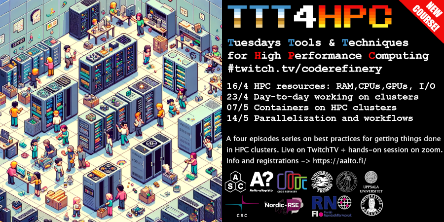

Tuesday Tools & Techniques for High Performance Computing
=========================================================

.. admonition:: Quick links

   - Watching link: https://twitch.tv/coderefinery
   - `Video playlist
     <https://www.youtube.com/playlist?list=PLpLblYHCzJABy4epFn-rqsfDbUZ1ff5Pl>`__
   - Materials

     - `Day 1 <https://coderefinery.github.io/TTT4HPC_resource_management/>`__
     - `Day 2 <https://coderefinery.github.io/TTT4HPC_Interactive/>`__
     - `Day 3 <https://coderefinery.github.io/hpc-containers/>`__
     - `Day 4 <https://coderefinery.github.io/TTT4HPC_parallel_workflows/>`__

Do you use supercomputers in your research work? Are you curious about 
making your computing faster and more efficient? Join us for TTT4HPC: 
four self-contained episodes on best practices in High Performance Computing. 
This is a great chance to enhance your computational skills. What you will learn 
is also used a lot outside academia whenever large scale computations are needed.

The course happens **online**. Mornings (2h) lectures via TwitchTV. Afternoons (1.5h) hands-on exercises on zoom with our HPC experts. 

Here below you find the list of episodes and how to register. Episodes are self-contained,
you can join only for the episodes that are useful for your research.

Episode 1 - 16/04/2024 - HPC Resources: RAM, CPUs/GPUs, I/O
-----------------------------------------------------------
**Content**: focus on HPC computational resources, starting with understanding and managing memory, CPUs, and GPUs, monitoring computational processes and I/O, utilizing local disks and ramdisks, and extending into benchmarking and selecting job parameters.

**Instructors**: Jarno Rantaharju, Radovan Bast, Diana Iusan, Simo Tuomisto

**Learning materials**: `Managing resources on HPC <https://coderefinery.github.io/TTT4HPC_resource_management/>`__

**Registration**: `Please register at this link <https://link.webropol.com/ep/ttt4hpc1>`__

**Schedule** for the day in EEST (Helsinki, Oslo+1) timezone
 - 09:50-10:00 Streaming starts with icebreakers https://www.twitch.tv/coderefinery
 - 10:00-12:00 Episode 1 - HPC Resources
    - Job scheduling and Slurm basics
    - How to choose the number of cores by timing a series of runs
    - Measuring and choosing the right amount of memory
    - I/O Best Practices
 - 12:00-13:00 Lunch (on your own)
 - 13:00-14:30 Hands-on exercises on zoom (register to receive link)

**How to attend**: You can watch the streaming at https://www.twitch.tv/coderefinery, but you need to register to get access to the shared document for questions and answers, and the zoom room for the afternoon session.

Episode 2 - 23/04/2024 - Day-to-day working on clusters
-------------------------------------------------------
**Content**: focus on software development on HPC, syncing data, interactive work with HPC, vscode

**Learning materials**: `Interactive <https://coderefinery.github.io/TTT4HPC_Interactive/>`__

**Registration**: `Please register at this link <https://link.webropol.com/ep/ttt4hpc2>`__

**Schedule** for the day in EEST (Helsinki, Oslo+1) timezone
 - 09:50-10:00 Streaming starts with icebreakers https://www.twitch.tv/coderefinery
 - 10:00-12:00 Episode 2 - Day-to-day working on clusters
    - Syncing data and code
    - Developing and interacting with HPC
    - Using VScode with HPC clusters
 - 12:00-13:00 Lunch (on your own)
 - 13:00-14:30 Hands-on exercises on zoom (register to receive link)

Episode 3 - 07/05/2024 - Containers on clusters
-----------------------------------------------
**Content**: focus on containers with Apptainer/Singularity, how to build containers for HPC, how to work with the filesystem, other practical examples with containers

**Learning materials**: `Containers <https://coderefinery.github.io/hpc-containers/>`__

**Registration**: `Please register at this link <https://link.webropol.com/ep/ttt4hpc3>`__

**Schedule** for the day in EEST (Helsinki, Oslo+1) timezone
 - 09:50-10:00 Streaming starts with icebreakers https://www.twitch.tv/coderefinery
 - 10:00-12:00 Episode 3 - Containers on clusters
    - Intro to containers on HPC
    - Using Apptainer/Singularity in practice
    - Advanced cases for containers in HPC
 - 12:00-13:00 Lunch (on your own)
 - 13:00-14:30 Hands-on exercises on zoom (register to receive link)

Episode 4 - 14/05/2024 - Parallelization and workflows
------------------------------------------------------
**Content**: focus on parallelization with HPC, efficient parameter sweeps, workflow automation, hyperscaling pitfalls

**Learning materials**: `Parallelizing without parallelizing <https://coderefinery.github.io/TTT4HPC_parallel_workflows/>`__

**Registration**: `Please register at this link <https://link.webropol.com/ep/ttt4hpc4>`__

**Schedule** for the day in EEST (Helsinki, Oslo+1) timezone
 - 09:50-10:00 Streaming starts with icebreakers https://www.twitch.tv/coderefinery
 - 10:00-12:00 Episode 4 - Parallelization and workflows
    - Parallelization with HPC
    - Workflow automation 
    - Hyperscaling pitfalls
 - 12:00-13:00 Lunch (on your own)
 - 13:00-14:30 Hands-on exercises on zoom (register to receive link)

Prerequisites
-------------
You won't be able to engage with the exercises and examples of the course if you don't have access to an HPC cluster. Usually employers from higher education institutions can always request access to HPC resources. If you are unsure, please get in touch with your local support. Being familiar with basics tools used with HPC and remote computing is fundamental for this course. Familiarize yourself with the Linux command line. You should be familiar with basics concepts and rules of HPC systems. You can watch our past training on "`Introduction to HPC (aka kickstart) <https://www.youtube.com/watch?v=dThyrEXfAbM&list=PLZLVmS9rf3nMKR2jMglaN4su3ojWtWMVw>`__"

Credits
-------
It is possible to receive 1 ECTS. Here what is required:

   - be affiliated with a research organisation. Your submission must come from an email address of a research organisation.
   - attend all four zoom exercise sessions. During the zoom session send a zoom chat message to Enrico Glerean to mark your presence. You can miss at maximum one session. Please arrange an extra task with Enrico Glerean to compensate for the absence.
   - Submit a tar or zip file with four folders, one folder for each of the four episodes. Inside each folder include the scripts, code, commands that you wrote and run during the exercise sessions. Please make sure that all the files submitted have clear comments that explain each of the steps in relation to the exercises and what was done in the zoom session. Provide the output of each of the scripts or commands that you have run (for example as a copy paste from the terminal into a txt file is enough). If the output is very long, it is ok to just copy what is left visible in the terminal.
   - Submit a learning diary for each episode: a short text that highlights i) what went well with the episode, ii) what could be improved, iii) how you will use what you have learned. 

From your organisation's email address, email all these files to scip _at_ aalto.fi by the last day of May 2024. Learners at Aalto University: please include your student number to get the credit registered automatically. Learners from other universities: you might want to check with your study coordinator if you can convert the certificate from this course into 1 ECTS. If they have questions, you can tell them to get in touch with Enrico Glerean

Questions
---------
- Q: Can I get a certificate even though I am not affiliated with a University or other research organisation?
- A: Unfortunately we provide credits only for students or researchers affiliated with research organisations.

- Q: I received a calendar invitation only for one of the episodes, but I marked that I want to register for all episodes, how can I get a calendar invitation?
- A: We do not have a clever system for sending multiple calendar invitations at once. If you find calendar invitations useful, you need to register manually to each of the four episodes.

- Q: The materials are not yet ready, when will they be ready?
- A: This is the first run ever for this course, so we are still tweaking learning materials until the last minutes before the course. Your feedback is highly appreciated to turn this pilot into a course that we can run again in the future. Consider contributing to the learning materials by joining the CodeRefinery Zulip chat.

Contributors and Acknowledgments
--------------------------------

Course coordinator: Enrico Glerean.

Episodes coordinators: Richard Darst, Samantha Wittke, Simo Tuomisto, Enrico Glerean, Thomas Pfau

Contributors to learning materials:  Richard Darst, Samantha Wittke, Simo Tuomisto, Enrico Glerean, Thomas Pfau, Radovan Bast, Diana Iusan, Dhanya Pushpadas, Hossein Firooz, Jarno Rantaharju, Maiken Pedersen.

Communication partners: CSC, University of Trömsö, University of Bergen, Uppsala University, University of Oslo.

See also / more info
--------------------
Chat with us in the `CodeRefinery chat
<https://coderefinery.zulipchat.com>`__ or :ref:`Aalto SciComp chat
<chat>`.  Or private contact via
Enrico Glerean, scip -a-t- aalto.fi.
