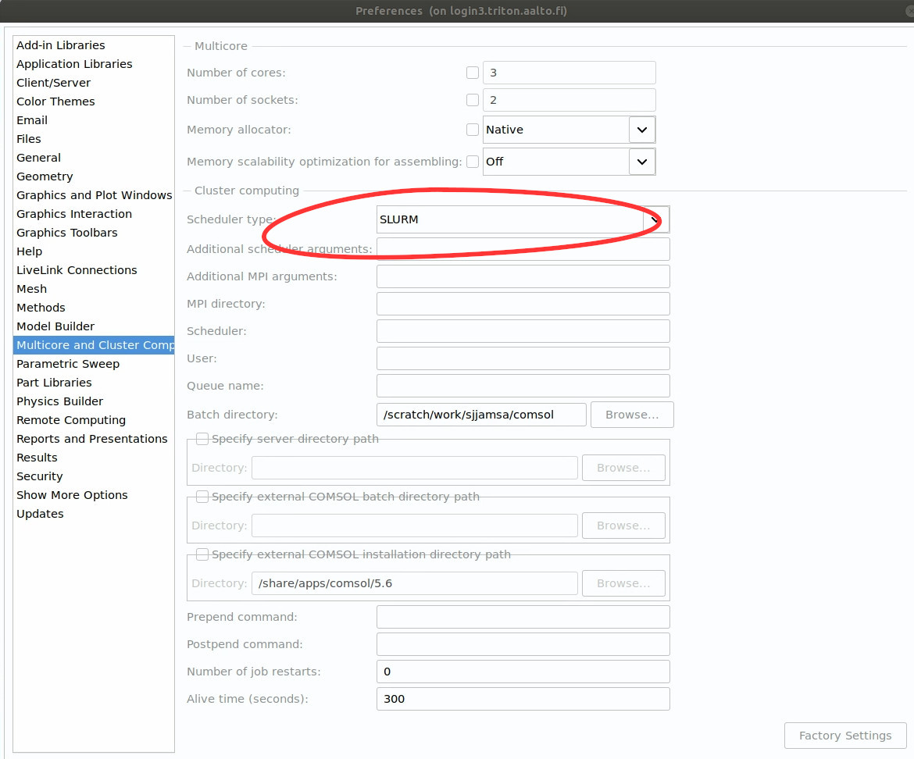

COMSOL Multiphysics
~~~~~~~~~~~~~~~~~~~

.. _comsol:

.. hint:: We will retry the COMSOL focus days in our :ref:`daily zoom garage<scicomp-garage>` in Spring 2025: someone from COMSOL (the company) plans to join our zoom garage at 13:00 on the following Wednesday: 2025-01-15. The continuation of the focus days depends on the popularity of the first session.

.. hint:: Join the other COMSOL users in our Zulip :ref:`chat`: Stream "#triton", topic "Comsol user group".

To check which versions of Comsol are available, run::

          module spider comsol

Comsol in Triton is best run in `Batch-mode <https://www.comsol.com/blogs/how-to-run-simulations-in-batch-mode-from-the-command-line/>`_, i.e. without the graphical userinterface. Prepare your models on your workstation and bring the ready-to-run models to triton. For detailed tutorials from COMSOL, see for example the Comsol Knowledge base articles `Running COMSOL® in parallel on clusters <https://www.comsol.com/support/knowledgebase/1001>`_ and `Running parametric sweeps, batch sweeps, and cluster sweeps from the command line <https://www.comsol.com/support/knowledgebase/1250>`_. However, various settings must be edited in the graphical user interface.

Best practices of using COMSOL Graphical User Interface in Triton
-----------------------------------------------------------------

1) Connect to triton
   
   - Use :ref:`Open OnDemand<ood>` for the best experience for interactive work on triton.
     
    1) Connect to `<https://ondemand.triton.aalto.fi>`_ with your browser, log in. (It currently takes a while, please be patient.) Choose "My Interactive Sessions" from top bar, and then "Triton Desktop" from bottom. Launch your session, and once resources become available in triton, the session will be started on one of the interactive session nodes of triton. You can connect to a desktop in your browser with the "Launch Triton Desktop" button.

    2) Once you have connected, you can open a terminal (in XFCE the black rectangle in the bottom of the screen).
       
  - You can alternatively open a linux session in `<https://vdi.aalto.fi>`_.
    
    1) Open a terminal, and connect with ssh to triton login node

      ::
      
          ssh -Y triton.aalto.fi

      However, if you use this terminal to start COMSOL, it will be running on the login node, which is a shared resource, and you should be careful not to use too much memory or CPUs.

2) Start comsol

   1) First make sure you have graphical connection (should print something like ":1.0")

      ::
      
        echo $DISPLAY

   2) then load the comsol module (version of your choice)

      ::
      
        module load comsol/6.1

   3) and finally start comsol

      ::
   
	comsol

	
Prerequsities of running COMSOL in Triton
-----------------------------------------

There is a largish but limited pool of floating COMSOL licenses in Aalto University, so please be careful not launch large numbers of comsol processess that each consume a separate license.
	  
-  Comsol uses a lot of temp file storage, which by default goes to
   ``$HOME``. Fix a bit like the following::

       $ rm -rf ~/.comsol/
       $ mkdir /scratch/work/$USER/comsol_recoveries/
       $ ln -sT /scratch/work/$USER/comsol_recoveries/ ~/.comsol

- You may need to  enable access to the whole filesystem in *File|Options --> Preferences --> Security*: **File system access:** "*All files*"
 
  .. image:: comsol_preferences_security.jpg
	     :width: 50%
	     :alt: Figure showing the comsol security preferences dialog box: File system access: All files is highlighted.

- Enable the "Study -> Batch and Cluster" as well as "Study -> Solver and Job Configurations" nodes in the "Show More Options dialog box you can open by right-clicking the study in the Model Builder Tree.
		   
  

The cluster settings can be saved in comsol settings, not in the model file. The correct settings are entered in *File|Options --> Preferences --> Multicore and Cluster Computing*. It is enough to choose **Scheduler type**: "*SLURM*" 

	   
You can test by loading from the Application Libraries the "cluster_setup_validation" model. The model comes with a documentation -pdf file, which you can open in the Application Libraries dialogue after selecting the model.

COMSOL requires MPICH2 compatible MPI libraries::

  $ module purge
  $ module load comsol/6.1 intel-parallel-studio/cluster.2020.0-intelmpi

A dictionary of COMSOL HPC lexicon
----------------------------------

The knowledge base article `Running COMSOL® in parallel on clusters <https://www.comsol.com/support/knowledgebase/1001>`_ explains the following meanings COMSOL uses:

.. list-table:: COMSOL HPC lexicon
   :widths: 25 25 25
   :header-rows: 1

   * - COMSOL
     - SLURM & MPI
     - 
   * - node
     - task
     - A process, software concept
   * - host
     - node
     - A single computer
   * - core
     - cpu   
     - A single CPU-core

However, COMSOL does not seem to be using the terms in a 100% consistent way. E.g. sometimes in the SLURM context COMSOL may use node in the SLURM meaning.

  
An example run in a single node
-------------------------------

Use the parameters ``-clustersimple`` and ``-launcher slurm``. Here is a sample batch-job::

          #!/bin/bash

          # Ask for e.g. 20 compute cores
          #SBATCH --time=10:00:00
          #SBATCH --mem-per-cpu=2G
          #SBATCH --cpus-per-task=20

          cd $WRKDIR/my_comsol_directory
          module load Java
          module load comsol/6.1
	  module load intel-parallel-studio/cluster.2020.0-intelmpi

          # Details of your input and output files
          INPUTFILE=input_model.mph
          OUTPUTFILE=output_model.mph

          comsol batch -clustersimple -launcher slurm -inputfile $INPUTFILE -outputfile $OUTPUTFILE -tmpdir $TMPDIR

	  

Cluster sweep
-------------

If you have a parameter scan to perform, you can use the Cluster sweep node. The whole sweep only needs one license even if comsol launches multiple instances of itself.

First set up the cluster preferences, as described above.

Start by loading the correct modules in triton (COMSOL requires MPICH2 compatible MPI libraries). Then open the graphical user interface to comsol on the login node and open your model. ::

  $ module purge
  $ module load comsol/6.1 intel-parallel-studio/cluster.2020.0-intelmpi
  $ comsol

Add a "Cluster Sweep" node to your study and a "Cluster Computing" node into your "Job Configurations" (You may need to first enable them in the "Show more options". Check the various options. You can try solving a small test case from the graphical user interface. You should see COMSOL submitting jobs to the SLURM queue. You can download an  :download:`example file <ringing_plate_cluster_sweep.mph>`.
 

For a larger run, COMSOL can then submit the jobs with comsol but without the GUI::

  $ comsol batch -inputfile your_ready_to_run_model.mph -outputfile output_file.mph -study std1 -mode desktop

See also how to `run a parametric sweep from command line? <https://www.comsol.com/support/knowledgebase/1250>`_

  
Since the sweep may take some time to finnish, please consider using `tmux <https://github.com/tmux/tmux/wiki/Getting-Started>`_ or `screen <https://www.gnu.org/software/screen/manual/screen.html#Getting-Started>`_ to keep your session open.

MATLAB + COMSOL --  livelink
----------------------------

It is possible to control COMSOL with MATLAB. The `blog post <https://knifelees3.github.io/2019/07/06/A_En_How_To_Use_COMSOL_LiveLink_With_MATLAB/#Run-COMSOL-live-link-with-MATLAB-on-server>`_ by KnifeLee was useful in preparation of this example.

Save a username and password for COMSOL mph server
**************************************************

Before your first use, you need to save the username and password for COMSOL mph server. On the login node, run::

  $ module load comsol/6.1
  $ comsol mphserver
  
And COMSOL will ask for you to choose a username and password. You can close the comsol server with "close".

Please note, that each instance of the below process uses a COMSOL licence, so this method is not useful for parameter scans.

Example files for batch job workflow
************************************

Please check the available versions and installation locations of comsol and update the below scripts accordingly:

          module spider comsol
          module show comsol/6.2

The installation folder is on the line with "prepend_path".

Here is an example batch submit script ``comsol_matlab_livelink.sh``::

  #!/bin/bash

  #SBATCH --time=10:00:00

  # Ask for a single node, since the port for connections between COMSOL and MATLAB is by default using port 2036,
  # and this is an easy way to avoid clashes between multiple jobs.
  #SBATCH --nodes=1
  #SBATCH --exclusive
  
  
  module load matlab
  module load comsol/6.1
 

  echo starting comsol server in the background
  comsol mphserver &
  echo comsol is now running
  
  matlab -nodesktop -nosplash -r "runner;exit(0)"
  echo matlab closed

The MATLAB process is running the ``runner.m`` script::

  disp('Including comsol routines into the path.')
  addpath /share/apps/comsol/5.6/mli/

  disp('Connecting to COMSOL from MATLAB')
  mphstart(2036)
  disp('Connection established')
  
  disp('Starting Model Control Script')

  script;
  
  disp('Exiting Matlab')
  exit(0);

The Model Control Script ``script.m`` could be e.g. the following::

  import com.comsol.model.*;
  import com.comsol.model.util.*;
  model = ModelUtil.create('Model1');  
  model.component.create('comp1', true);
  %...

The job is submitted with::

  $ sbatch comsol_matlab_livelink.sh

Cluster computing controlled from your windows workstation
----------------------------------------------------------

The following example shows a working set of settings to `use triton as a remote computation cluster for COMSOL <https://www.comsol.com/blogs/how-to-run-on-clusters-from-the-comsol-desktop-environment/>`_.

Prerequisities:

 * Store `ssh-keys <https://devops.ionos.com/tutorials/use-ssh-keys-with-putty-on-windows/>`_ in pagent so that you can connect to triton with putty without entering the password.

 * Save / install `putty executables <https://www.chiark.greenend.org.uk/~sgtatham/putty/latest.html>`_ locally, e.g. in Z:\\putty:

   * plink.exe

   * pscp.exe

   * putty.exe

   .. image:: comsol_cluster_computing.jpg
	     :width: 50%
	     :alt: Figure showing the comsol settings for Cluster Computing.

   In this configuration, ``sjjamsa`` is replaced with your username.

   .. image:: comsol_cluster_computing_1.jpg
	     :width: 50%
	     :alt: Figure showing the comsol settings for Cluster Computing within the Job Configurations.

  
..
  /share/apps/spack/envs/fgci-centos7-generic/software/intel-parallel-studio/cluster.2020.0/ttn75qk/compilers_and_libraries_2020.0.166/linux/mpi/intel64/bin/mpirun
