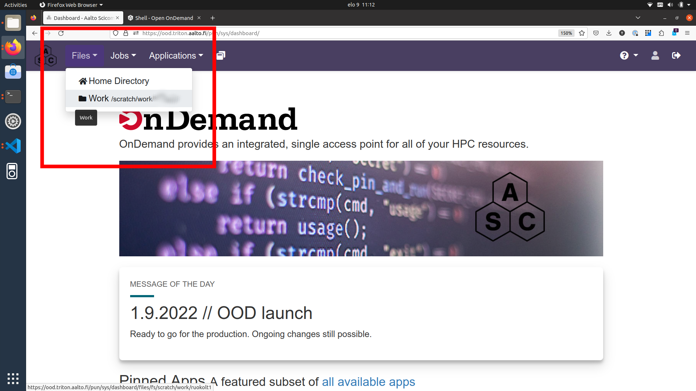
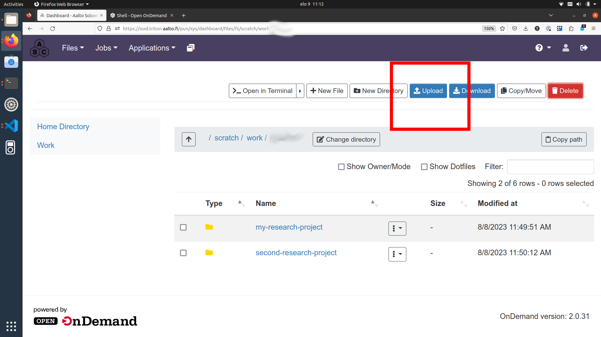
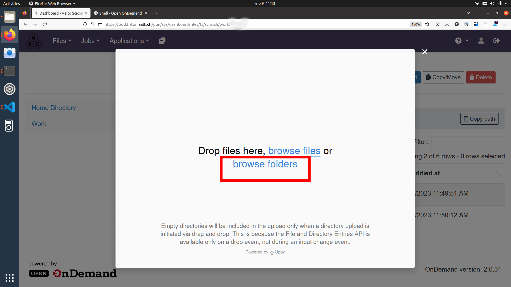
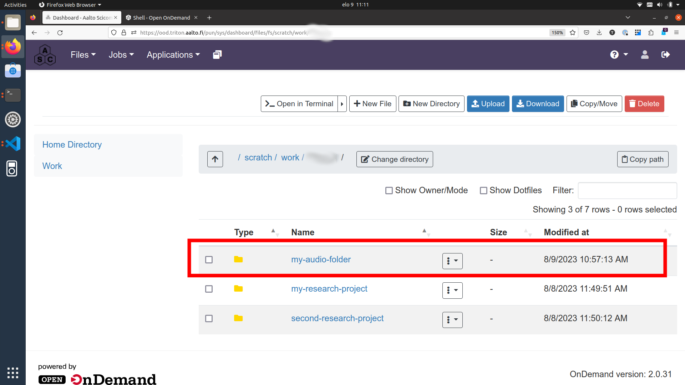
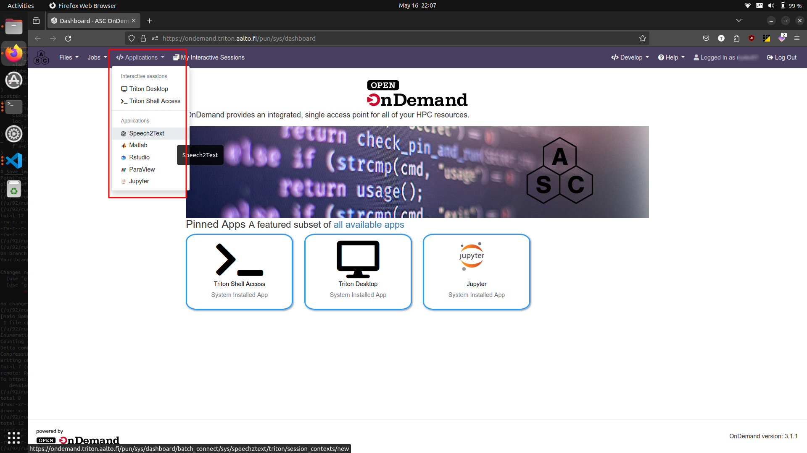
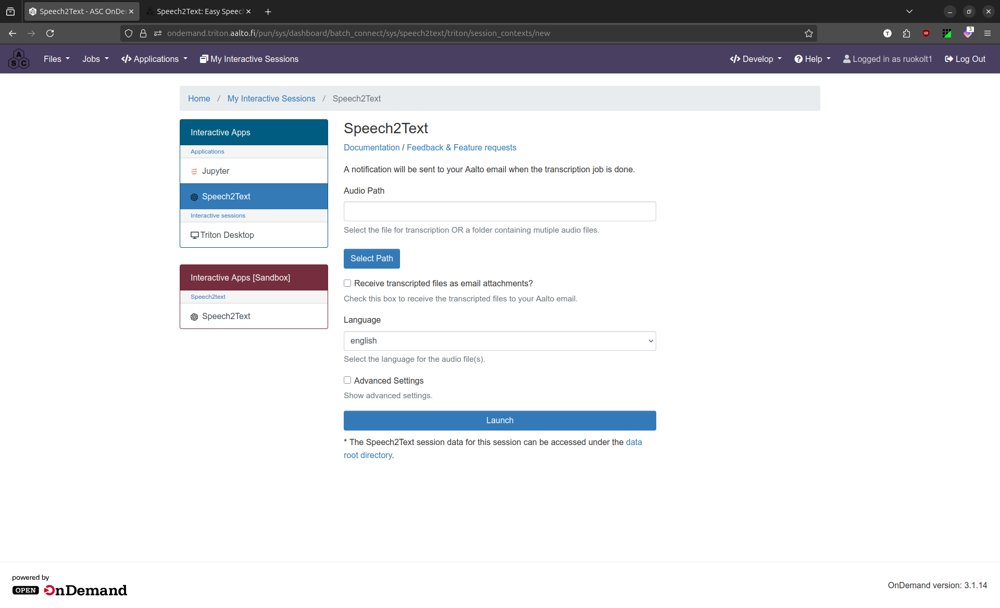

======================================
Speech2Text: Easy Speech Transcription
======================================

Aalto speech2text app is available to researchers of Aalto University. 

The app is run on the :doc:`Aalto Triton cluster </triton/index>` and its usage is free for all Aalto researchers (master's thesis workers, doctoral students, post docs, visiting researchers). 

Supported languages are:

Arabic, Armenian, Bulgarian, Catalan, Chinese, Czech, Danish, Dutch, English, Estonian, Finnish, French, Galician, German, Greek, Hebrew, Hindi, Hungarian, Icelandic, Indonesian, Italian, Japanese, Kazakh, Korean, Latvian, Lithuanian, Malay, Marathi, Nepali, Norwegian, Persian, Polish, Portuguese, Romanian, Russian, Serbian, Slovak, Slovenian, Spanish, Swedish, Thai, Turkish, Ukrainian, Urdu, Vietnamese

.. note::

    If you use speech2text in your research, :doc:`please acknowledge Triton and the Aalto Science-IT project in your publication </triton/acknowledgingtriton>`. 

In order to transcribe your speech files into text, apply the following steps (detailed instructions in the sections below):

#. Create a Triton cluster account (only done once)
#. Connect to Triton
#. Copy your audio and/or video files to Triton
#. Submit the uploaded files for processing
#. Inspect and copy result to your personal computer
#. Delete unneeded files and folders from Triton workspace (optional)

.. note::

    The workflow described here is suitable for processing sensitive and personal data.
    All data uploaded to and processed on Triton are stored on servers managed by Aalto and can only be accessed from within Aalto network. The files and folders on Triton are protected by standard Unix permissions so that only their owner (you) and Triton administrators can access them.

.. note::

    If at any point something doesn't work or you are unsure how to proceed, do not hesitate to contact :doc:`the Aalto RSEs </rse/index>`. 

    You can visit us at :ref:`the daily Zoom help session at 13.00-14.00 <garage>` where we can e.g. create a Triton account for you, walk through the speech2text workflow together, answer questions, help with data analysis, and more.

    You can also check the items in :ref:`speech2text-known-issues-and-troubleshooting`.

Create a Triton account (only done once)
=========================================

Triton is the Aalto high-performance computing cluster where we will run the speech2text app. 

Access is free for Aalto researchers.

If you don't already have a Triton account, please, visit the :doc:`account page </triton/accounts>` and proceed to fill the account request form. 

.. note::

    Activating the account takes on average 1-2 work days. 

    However, if you are in a hurry, visit us at :ref:`the daily Zoom help session at 13.00-14.00 <garage>` and we can speed up the process.

The Triton account needs to be created only once.

Connect to Triton
=================

Go to Triton's web browser interface `Open On Demand <http://ondemand.triton.aalto.fi>`__. 

Log in with your **Aalto username and password**. (You will be granted access since your Aalto account has been synced with your Triton account.)

.. note::

    To connect to Open On Demand, you need to be inside Aalto network OR use the Aalto VPN.

Copy your audio and/or video files to Triton
============================================

On the Open On Demand front page, click the ``Files`` dropdown menu from the left upper corner and select ``Work /scratch/work/yourusername``.

On the ``Files`` page, you can see the existing contents (files and folders) of your workspace on Triton.

Click on the ``Upload`` button in the right upper corner.

In the following pop-up window, select ``browse folders``.

In the following file browser, you will able to select the folder on your computer with the audio/video files. (Here, the folder we are uploading is called ``my-audio-folder``.)

.. note::

    Audio files can be of any common audio format, e.g. ``.wav``, ``.aiff``, ``.mp3``, ``.m4a``, ``.aac``, ``.ogg``
  
    The files can also be of any comon video format, e.g. ``.mp4``, ``.mov``, ``.avi``
 
.. note::

    It is recommended to divide files into folders according to language. For example, put English interview files in folder ``my-english-interviews``, French interviews to ``my-french-interviews``, and so forth.

    Put the audio files in folders even if you only have one. This will keep your project files organized on both Triton and your own computer.
    
Finally, if your browser asks for confirmation, (``Are you sure you want to upload all files from “my-audio-folder”? Only do this if you trust the site.``), you can answer "yes".

Depending on the number and size of your audio files and the quality of your internet connection, the transfer can take a short or a long time (from a few seconds to several hours).

After the transfer is done, you should see your folder in the list of existing content on the ``Files`` page.

Submit the uploaded files for processing
=========================================

Open the ``Applications`` drop down menu from the left upper corner and choose speech2text.

This opens the speech2text submission form.

In the submission form

#. Use the ``Select Path`` button to browse and select your audio file/folder you just uploaded to Triton. This field is mandatory.

#. Add your Aalto email address. This field is mandatory.

#. Choose language of the audio. This field is mandatory.

#. You can leave the Model version field to "default" - this will use the latest available model.

Finally, press ``Launch`` and you're done! 

You will get an email notification when the results are available.

Inspect and copy result to your personal computer
==================================================

After receiving an email saying audio file(s) has finished processing, log back into `Open On Demand <http://ondemand.triton.aalto.fi>`__.

At the Open On Demand front page, select again the ``Files`` and ``Work`` page (upper left corner). Enter your audio folder. 

You should now see the newly created ``results`` folder.

Enter the ``results`` folder and notice there are two result files corresponding to each audio file:

- ``.csv`` (computer-friendly, e.g. ``test.csv``)

- ``.txt`` (human-friendly, e.g. ``test.txt``)

Example of ``.csv`` output format (computer-friendly):

.. code-block::

    start,end,speaker,transcription
    00:00:00,00:00:05,SPEAKER_00,"This is the first sentence of the first speaker."
    00:00:06,00:00:10,SPEAKER_00,"This is the second sentence of the first speaker."
    00:00:11,00:00:15,SPEAKER_01,"This is a sentence from the second speaker."
    00:00:16,00:00:20,SPEAKER_00,"This is the first speaker speaking again."

Corresponding example of ``.txt`` output format (human-friendly):

.. code-block::

    (00:00:00 - 00:00:10) SPEAKER_00

    This is the first sentence of the first speaker. This is the second sentence of the first speaker.

    (00:00:11 - 00:00:15) SPEAKER_01

    This is a sentence from the second speaker.

    (00:00:16 - 00:00:20) SPEAKER_00

    This is the first speaker speaking again.

The ``.txt`` files have basic text format and can be opened in a text editor (e.g. Microsoft Word, Google Docs). 

The ``.csv`` files have comma separated table format which is easy to read by computers and can be opened in a spreadsheet software (e.g. Microsoft Excel, Google Sheets).

You can either download individual result files or the whole ``results`` folder if you want to continue working on them on your personal computer using your preferred software. (Check the dropdown menus next to individual files and folders.)

Delete unneeded files and folders from Triton workspace (optional)
==================================================================

If you do not need your audio and/or result files and/or folders, you can remove them by selecting ``Delete`` from the dropdown menus next to individual files and folders.

.. _speech2text-known-issues-and-troubleshooting:

Known issues and troubleshooting
================================

If at any point something doesn't work or you are unsure how to proceed, do not hesitate to contact `the Aalto RSEs <https://scicomp.aalto.fi/rse/>`__. You can visit us at :ref:`the daily Zoom help session at 13.00-14.00 <garage>` where we can walk through the speech2text workflow together, debug problems, answer questions, help with data analysis, and more.

Can I use the speech2text app from the terminal (command line)?
---------------------------------------------------------------

Yes! Check the command line usage from the `speech2text GitHub repository <https://github.com/AaltoRSE/speech2text?tab=readme-ov-file#command-line>`__.

My transcription has a weird segment where a word or two are repeated over and over.
-------------------------------------------------------------------------------------

This is a quite known issue with the OpenAI Whisper speech recognition model. 

The behavior is sometimes triggered by bad audio quality during that segment (background noise, mic issues, people talking over each other). However, sometimes this seems to happen even with good audio quality. 

Unfortunately, there is little we can do about this at the moment. We recommend you to submit the file again as there is some randomness in the transcription results. If the problem persists, you have to transcribe that particular audio segment manually.

Why do we use work directory ``Work /scratch/work/user-name`` instead of ``Home Directory``?
---------------------------------------------------------------------------------------------

``Home Directory`` has a small disk space quota (10Gb) and ``/scratch/work/`` has a large one (200Gb), and we can easily add even more space if it is needed. Workspace disk is also faster than the home directory.

What if my audio file contains speech in more than one language?
-----------------------------------------------------------------

If an audio file contains speech in more than one language, the result may contain translations of the transcriptions, which is usually not what you want. This is due to the Whisper speech transcription model used by speech2text.

In some cases, this can be avoided easily. For example, if the language changes at the middle of the audio, just split the file into two parts and process them separately. You can use any available audio software to do this, for example, `Audacity <https://www.audacityteam.org/>`__.

What happens if I submit speech2text audio file(s) that have already been processed and completed?
--------------------------------------------------------------------------------------------------

This is safe to do: speech2text checks if the expected result files already exist and if so, exits early without doing any further processing.

I submitted my audio files with wrong language. What to do?
------------------------------------------------------------

Wait until the processing is finished, delete the ``results`` folder, and submit the job again with the correct language.
