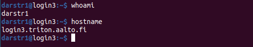

Using the cluster from a command line
=====================================

.. include:: /triton/ref/videos.rst

A **shell** is the **command-line terminal interface** which is the
most common method of accessing remote computers.  If you are using a
cluster, you aren't just
computing things.  You are programming the computer to do things
for you over and over again.  *The shell is the only option to make
this work, so you have to learn a little bit*.

.. figure:: https://raw.githubusercontent.com/AaltoSciComp/aaltoscicomp-graphics/master/figures/cluster-schematic/cluster-schematic-login.png
   :alt: Schematic of cluster with current discussion points highlighted; see caption or rest of lesson.

   We are still only on the login node.  If you stop here, you aren't
   actually using the cluster - just the entry point.  If you run too
   much code here, you'll get a polite message asking to use the rest
   of the cluster.

.. highlight:: console

Terminology
-----------

* A **terminal** is the physical or software device that sends lines
  and shows the output.
* A **shell** is the interface that reads in lines, does something with
  the operating system, and sends it back out.
* The **command line interface** refers to the general concept of
  these lines in, lines out.

All these terms are usually used somewhat interchangably.

Why command line interfaces?
----------------------------

The shell is the most powerful interface to computers: you can script
other programs to do things automatically.  It's much easier to script
things with text, than by clicking buttons.  It's also very easy to
add the **command line interfaces** to programs to make them
scriptable. Shells, such as **bash** or **zsh**, are basically
programming languages designed to connect programs together.

   Image of a terminal - this is what does it all.

In the image above, we see a pretty typical example.  The **prompt**
is ``darstr1@login3:~$`` and gives a bit of info about what computer
you are running on.  The **commands** ``whoami`` tells who you are
(``darstr1``) and ``hostname`` tells what computer you are on
(``login3.triton.aalto.fi``).

You can also give **options** and **arguments** to programs, like
this::

  $ python pi.py --seed=50

The parts are like this:

* ``python`` is the program that is run.
* ``pi.py`` and ``--seed=50`` are **arguments**.  It tells
  the program what to do, and the program can interpert them however
  it wants.  For Python, ``your-program.py`` is the Python file and
  that Python file itself knows how to handle ``--seed=50``.

These arguments let you control the program without modifying the
source code (or clicking buttons with your mouse!).  This lets us, for
example, make a shell script that runs with many different ``--seed``
values automatically (this is a hint about our future!).

You will learn all sorts of commands as you progress in your career.
The :ref:`command line quick reference <ref-command-line>` gives the
most important ones.

Files and directories
---------------------

On your phone and other "app"-like things, data just exists - you
don't really know where. Now, *you* are the programmer doing
scientific computing, so you have to make more meaningful decisions
about data arrangement.  This means knowing about **files** (a chunk of data) and
**directories** (hierarchical storage units, also known as folders).
*On a cluster, you can't throw everything into the same place. You
need to sort stuff and keep it organized.  File names are an essential
part of automating things.  Thus, you need knowledge of the storage
hierarchy*.

Everything on a Unix (Linux) system is organized in a hierarchy.
There aren't "drives" like "C-drive", different storage systems can be
available anywhere:

* ``/`` is the **root** of the filesystem
* ``/home/`` is a directory ("home directories")
* ``/home/darstr1/`` is the home directory of the user ``darstr1``
* ``/home/darstr1/git/`` is the directory darstr1 uses to store
  general git repositories.
* ... etc
* ``$HOME`` is an environment variable shortcut for your home directory.
* ``~`` is another shortcut for you home directory.
* On Triton, ``/scratch/`` is the basic place for storing research
  data.  Also on Triton, ``$WRKDIR`` is a shortcut for your personal
  space in scratch (this is an **environment variable**).

On a graphical computer, you open a window to view files, but this is
disconnected from how you run programs.  In a shell, they are
intrinsically connected and that is *good*.

The most common commands related to directories:

* ``pwd`` shows the directory you are in.
* ``cd NAME`` changes to a directory.  All future commands are
  relative to the directory you change to.  This is the **(current)
  working directory**
* ``ls [NAME]`` lists the contents of a directory.  ``[NAME]`` is an
  optional directory name - by default, it lists the working
  directory.
* ``mkdir NAME`` makes a new directory
* ``rm -r NAME`` removes a directory (or file) recusrsively - that and
  everything in it!  There is no backup, be careful.

Exercises, directories
~~~~~~~~~~~~~~~~~~~~~~

You have to be :doc:`connected to the custer and have a terminal
<connecting>` to do these exercises.

.. exercise:: Shell-1: Explore directories

  If you are not at Aalto, try to do similar things but adjusted to
  your cluster's data storage.

  * Print your current directory with ``pwd``
  * List the contents with ``ls``
  * List the contents of ``/scratch/``, then the contents of another
    directory within it, and so on.
  * List your work directory ``$WRKDIR``.
  * Change to your work directory.  List it again, with a plain ``ls``
    (no full path needed).
  * List your home directory from your work directory (you need to
    give it a path)
  * Log out and in again.  List your current directory.  Note how it
    returns to your home directory - each time you log in, you need to
    navigate to where you need to be.

  .. solution::

    .. code-block:: console

      $ pwd
      /home/darstr1
      $ ls
       ## (lots of stuff here.  Or maybe nothing, if your account is 
       ## brand new)
      $ ls /scratch/
      admin/     cs/       nbe/      rse/      shareddata/
      apps/      elec/     other/    scicomp/  work/
      courses/   eng/      math/     phys/     scip/
       ## (will vary for you)
      $ ls $WRKDIR
       ## (output will vary for you.  Or might be empty if nothing is
       ## there yet)
      $ cd $WRKDIR
      $ ls
       ## (same output as before)
      $ ls $HOME
      $ ls ~
       ## (commands give same output.  Maybe empty if nothing is there
       ## yet)

    To log out:

    .. code-block:: console

      $ exit

    Logging in again:

    .. code-block:: console

      you@laptop$ ssh USERNAME@triton.aalto.fi
      $ pwd
      /home/darstr1
      $ cd $WRKDIR

.. exercise:: Shell-2: Understand power of working directory

  * ``ls /scratch/cs/``
  * Change directory to ``/scratch``
  * Now list ``/scratch/cs``, but don't re-type ``/scratch``.

   .. solution::

      .. code-block:: console

        $ ls /scratch/cs/
        $ cd /scratch
        $ ls cs/

      After changing your current directory, you should see the same 
      output as from the first command with just ``ls cs``. 
      Like vast majority of commands, ``ls`` uses your relative path to the target. 
      Since you are already in ``/scratch/`` you don't need to type it
      again.

      You'll be using this concepts in your projects all the time.

.. _triton-tut-example-repo:

Copy your code to the cluster
-----------------------------

Usually, you would start by copying some existing code and data into
the cluster (you can also develop the code straight on the cluster).
Let's talk about the code first.  You would ideally have code in a
**git repository** - this **version control system (VCS)** can tracks
files, synchronizes versions, and most importantly lets you copy them
to the cluster easily.

You'd make a git repository on your own computer where you work.  You
would sync this with some online service (such as Github (github.com)
or Aalto Gitlab (version.aalto.fi)), and then copy it to the cluster.
Changes can go the other way.  (You can also go straight from
computer→cluster, but that's beyond the scope of now).  Git is outside
the scope of this tutorial, but you should see CodeRefinery's `git-intro course
<https://coderefinery.github.io/git-intro/>`__, and really all of
`CodeRefinery's courses <https://coderefinery.org>`__.  This isn't
covered any further here.

**We are going to pretend we are researchers working on a sample
project, named hpc-examples.  We'll pretend this is our research code
and keep using this example repository for the rest of the
tutorials.**  You can look at all the files in the repository here:
https://github.com/AaltoSciComp/hpc-examples/ .

Let's **clone** the HPC-examples repository so that we can work on it.
First, we make sure we are in our home directory (we always want to
make sure we know where we are!  The home directory is the default
place, though)::

  $ cd $HOME

Then we clone our git repository::

  $ git clone https://github.com/AaltoSciComp/hpc-examples/

We can change into the directory::

  $ cd hpc-examples

Now we have our code in a place that can be used.

.. warning::

  Storing your analysis codes in your home directory usually isn't
  recommended, since it's not large or high performance enough.  You
  will learn more about where to store your work in :doc:`storage`.

.. exercise:: Shell-3: clone the hpc-examples repository

  Do the steps above.  List the directory and verify it matches what
  you see in the `Github web interface
  <https://github.com/AaltoSciComp/hpc-examples/>`__.

  Is your home directory the right place to store this?

   .. solution::

      The steps are listed above.  You also can check that everything is
      correct with ``git status``. Output should be something like
      this::

         $ ls
         io/    mpi/     postgres/  R/          scip/      gpu/
         misc/  openmp/  python/    README.rst  slurm/

         $ git status
         On branch master
         Your branch is up to date with 'origin/master'.

         nothing to commit, working tree clean

      Normally, large projects you are working on should be in your
      work directory.  This is small enough we can ignore that for now
      (and make our exercises work on different clusters).

.. exercise:: Shell-4: log out and re-navigate to the hpc-examples reports

  Log out and log in again.  Navigate to the hpc-examples repository.
  Resuming work is an important but often forgotten part of work.

  .. solution::

    .. code-block:: console

      $ exit
      you@laptop$ ssh USERNAME@triton.aalto.fi
      $ cd hpc-examples
      $ ls
       ## (same output as previous exercise)

Running a basic program
-----------------------

But how would you actually run things?  Usually, you would:

* Decide where to store your code
* Copy your code to the cluster (like we did above with the
  hpc-examples repository)
* Each time you connect, change directory to the place with the code
  and run from there.

In our case, after changing to the hpc-examples directory, let's run
the program ``pi.py`` using Python (this will be our common example
for a while)::

  $ cd hpc-examples
  $ python3 slurm/pi.py 10000

The argument "10000" is the number of iterations of the `circle in
square <https://en.wikipedia.org/wiki/Pi#Monte_Carlo_methods>`__
method of calculating π.

.. danger::

  This is running your program on the login node!  Since this takes only
  a second, it's OK enough for now (so that we only have to teach one
  thing at a time).  Since May 2024, Triton limits resources for each
  logged in user, and running too much might possibly block future
  logins.

  You will learn how to run programs properly starting in :doc:`slurm`.

.. exercise:: Shell-5: try calculating pi

  Try doing what is above and running ``pi.py`` several times with
  different numbers of iterations.  Try passing the ``--seed`` command
  line option with the values ``13``, and ``19759``.

  **From this point on, you need to manage your working directory.
  You need to be in the hpc-examples directory when appropriate, or
  somehow give a proper path to the program to be run.**

  .. solution::

    All these are equivalent ways to run the program::

      $ python3 hpc-examples/slurm/pi.py 10000

      $ cd hpc-examples
      $ python3 slurm/pi.py 10000

      $ cd hpc-examples/slurm
      $ python3 pi.py 10000

    Running with different numbers of iterations::

      $ cd hpc-examples
      $ python3 slurm/pi.py 10000
      Calculating Pi via 10000 stochastic trials
      {"successes": 7815, "pi_estimate": 3.126, "iterations": 10000}
      $ python slurm/pi.py 100
      Calculating Pi via 100 stochastic trials
      {"successes": 78, "pi_estimate": 3.12, "iterations": 100}
      $ python slurm/pi.py 1000000
      Calculating Pi via 1000000 stochastic trials
      {"successes": 785148, "pi_estimate": 3.140592, "iterations": 1000000}

    Running with different values of the seed::

      $ python slurm/pi.py 10000 --seed=13
      Calculating Pi via 10000 stochastic trials
      {"successes": 7816, "pi_estimate": 3.1264, "iterations": 10000}
      $ python slurm/pi.py 10000 --seed=19759
      Calculating Pi via 10000 stochastic trials
      {"successes": 7817, "pi_estimate": 3.1268, "iterations": 10000}

.. exercise:: Shell-6: Try the ``--help`` option

  Many programs have a ``--help`` option which gives a reminder of the
  options of the program.  (Note that this has to be explicitly
  programmed - it's a convention, not magic.)  Try giving this option
  to ``pi.py`` and see what happens.

  .. solution::

    ``pi.py`` does have a ``--help`` option.  Libraries that handle
    command line arguments for you can auto-generate this help, which
    is useful even if you wrote the program yourself.  In this case,
    the help output is automatically generated by the Python standard
    library module `argparse
    <https://docs.python.org/library/argparse.html>`__.

    ::

      $ python slurm/pi.py --help
      usage: pi.py [-h] [--nprocs NPROCS] [--seed SEED] [--sleep SLEEP]
                   [--optimized] [--serial SERIAL]
                   iters

      positional arguments:
        iters            Number of iterations

      optional arguments:
        -h, --help       show this help message and exit
        --nprocs NPROCS  Number of nprocs, using multiprocessing
        --seed SEED      Random seed
        --sleep SLEEP    Sleep this many seconds
        --optimized      Run an optimized vectorized version of the code
        --serial SERIAL  This fraction [0.0--1.0] of iterations to be run serial.

Copying and manipulating files
------------------------------

More info: :doc:`/scicomp/shell`

* ``cp OLD NEW`` make a copy of OLD in NEW
* ``mv OLD NEW`` renames a file OLD to NEW
* ``rm NAME`` removes a file (with no warning or backup)

A file consists of its contents and metadata.  The metadata is information
like user, group, timestamps, permissions.  To view metadata, use ``ls
-l`` or ``stat``.

.. exercise:: Shell-7: (optional) Make a copy of pi.py

  Make a copy of the pi.py program we have been using.  Call it
  ``pi-new.py``

  .. solution::

    ::

      $ cd hpc-examples
      $ cp slurm/pi.py slurm/pi-new.py
      $ ls slurm/
      ... pi.py pi-new.py ...

    Note that we can copy a file without being in its directory if we
    use a relative path.

Editing and viewing files
-------------------------

You will often need to edit files (in other words, change their
contents).  You could do this on your computer and copy them over
every time, but that's really slow.  You can, and should, do basic
edits directly on the cluster itself.

* ``nano`` is an **editor** which allows you to **edit files** directly
  from the shell.  This is a simple console editor which always gets the
  job done.  Use *Control-x* (control and x at the same time), then
  ``y`` when requested and *enter*, to save and exit.

* ``less`` is a **pager** (file viewer) which lets you **view files**
  without editing them.  (``q`` to quit, ``/`` to search, ``n`` / ``N``
  to research forward and backwards, ``<`` for beginning of file, ``>``
  for end of file)

* ``cat`` dumps the contents of a file straight to the screen -
  sometimes useful when looking at small things.

.. exercise:: Shell-9: Create a new file and show its contents

  Create a new file ``poem.txt``.  Write some poem in it.  View the
  contents of the file.

  .. solution::

    First let's go back to our home directory, this doesn't seem to be
    an hpc-example.  ``cd`` with no arguments goes to home dir::

      $ cd
      $ pwd
      /home/darstr1

    Edit the file with nano.  When done, "Control-x" "y" to exit::

      $ nano poem.txt

    To display the contents of the file, we can ``cat`` it or use
    ``less`` (``q`` to quit less)::

      $ cat poem.txt
      When do we need the
      high performance computing
      cluster for our work?

.. exercise:: Shell-10: (optional, advanced) Edit py-new.py

  Remember the pi-new.py file you made?  Add some nonsense edits to it
  and try to run it.  See if it fails.

  .. solution::

    Remember we changed directories, so go back to place we cloned the
    repository, wherever it is (could this be the main point of the exercise?)::

     $ cd hpc-examples

    Confirm the file is there and edit the file.  Notice we don't have
    to go to its exact directory, a relative directory is OK::

      $ ls slurm/
      ... pi-new.py ...
      $ nano slurm/pi-new.txt

    Try to run it::

      $ python3 slurm/pi-new.py
        File "slurm/pi-new.py", line 10
          mxhbuhetihiugug euhuethuoegceuothoeu
                                             ^
      SyntaxError: invalid syntax

Exercises
---------

.. exercise:: Shell-11: (advanced, to fill time) shell crash course

   Browse the :doc:`/scicomp/shell` and see what you do and don't know
   from there.

   .. solution::

    Did you think there was a solution here?

See also
--------

This is only a short intro.

* :doc:`/scicomp/shell`: You really need to read
  this for more info. You can also watch a `short version (20 min)
  <https://youtu.be/56p6xX0aToI>`__ or `longer version (1 hour)
  <https://www.youtube.com/watch?v=ESXLbtaxpdI&list=PLZLVmS9rf3nN_tMPgqoUQac9bTjZw8JYc&index=3&t=1402s>`__.
  The shorter options are fine.
* `Working directory <https://en.wikipedia.org/wiki/Working_directory>`__
* `git-intro course <https://coderefinery.github.io/git-intro/>`__,
  and really all of `CodeRefinery's courses
  <https://coderefinery.org>`__

What's next?
------------

The next step is looking at the :doc:`applications available
<applications>` on the cluster.
